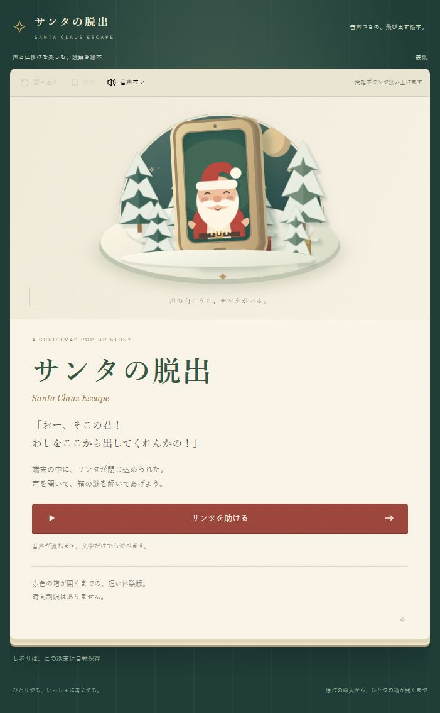

# Santa Claus Escape / サンタの脱出

サンタからの救難通信を聞き、手がかりを調べて箱を開ける、音声つきの絵本型ブラウザゲーム。

**日本語版は、導入・三つの箱・ひみつの言葉・まほう使いとの三問・サンタの救出まで遊べます。** 原作の問題群から固定の問題を選んでいます。英語版と問題のランダム出題は未実装です。



## 起動

Node.js 24以降を使用します。外部ライブラリはなく、`npm install` は不要です。

```sh
git clone https://github.com/takatama/santa-claus-escape.git
cd santa-claus-escape
npm start
```

ブラウザで `http://127.0.0.1:4173/` を開き、「サンタを助ける」から開始します。スマホ向けの一ページ表示と、広い画面の見開き表示があります。ローカル配信を使い、ゲームのバックエンドはありません。

## 遊べること

- 三つの箱を自由な順で調べる。四桁のダイヤルを回すか、数字を直接入力する。
- サンタと語り手の音声を聞く、聞き直す、止める、ミュートする。文字だけでも最後まで遊べる。
- 進行を端末内に保存し、再開・リセットする。
- 原作の知識クイズ・なぞなぞを解き、サンタを助ける。後半は不正解でも原作どおり遊びが進む。
- 救出後に、実際に遊んだ場面を絵本として読み返す。

声はGemini TTSで制作時に生成したWAVです。遊ぶときにAPIキー、生成AI、マイクは使いません。数字の誤答は、定型台詞と数字0〜9の事前収録音声を一つにつないで読みます。音声の読み込み・再生に失敗した場合だけブラウザ読み上げへ切り替わり、その声と品質は端末によって変わります。

妖精（日本語原作の「まほう使い」）は、三案の試聴から利用者が選んだLeda。ナレーターはSulafat、サンタはAlgiebaで、三役の声種を分けています。BGMは小さく調整しています。

効果音は、数字の確認や妖精の台詞が終わった後など、原作の発話区間に合わせて鳴ります。開箱後は残りの箱だけを短く案内します。[台詞と音の順番・変更記録](design/AUDIO-TIMING-NOTES.md)。

## 設計と確認記録

- [日本語全編の実装・原作との差分](prototype/FULL-GAME-NOTES.md) / [全編の確認記録](prototype/FULL-GAME-QA.md)。
- [Cloudflare Pagesの公開手順](docs/CLOUDFLARE-PAGES.md)：静的ファイルのみを `dist/` に出力。
- [全編の設計](design/FULL-GAME-DESIGN.md)：三箱の自由順、合言葉、魔法使いとの遊び、救出、絵と操作、音と保存。
- [原作音源の確認](design/AUDIO-ASSET-AUDIT.md)：BGM・効果音の出典、利用条件、未確認点。
- [原作との照合](prototype/SOURCE-NOTES.md)：台詞・謎とブラウザ向け変更。
- [絵本の確認](prototype/STORYBOOK-QA.md) / [音声の確認](prototype/AUDIO-QA.md)：実ブラウザでの確認と実機で未確認の点。

全編の2,592経路を設計モデルで検査しています。全編の画面・音声・実機を検証したという意味ではありません。原作のソースとDrive設定の参照コピーは公開リポジトリに含めず、照合の根拠と資料リンクを設計書に残しています。

## 検査

```sh
npm test
npm run check:design
npm run check:audio
npm run check:publication
npm run build
```

これらはローカルの検査で、外部APIを呼びません。非公開の原作コピーがない場合、原本との直接照合テストだけをスキップして明示します。状態遷移・入力・保存・音声ファイルの検査は公開版でも実行します。

`prototype/scripts/generate-audio.mjs --plan` は生成計画の表示のみです。`--sample` / `--all` / `--full` / `--answers` は制作専用で、未生成ファイルがある場合にGemini APIを呼びます。実行する場合は、自分のキーと利用枠を別途用意してください。通常の起動・テスト・ビルドでは実行しません。

上のスクリプトは初期収録の生成記録を再現するものです。採用後の妖精の声は `prototype/scripts/generate-fairy-production.mjs --plan` で確認できます。`--generate` は12場面を15音声として各一回生成し、`compose-fairy-scenes.mjs` は二話者ずつに分けた保留・救出の音声を制作時に結合します。声選びと採用の記録は [妖精の試聴](prototype/qa/FAIRY-VOICE-AUDITION.md)。

## ライセンス

実装コード、シナリオデータ、設計文書、SVG/CSSの絵、生成音声は [MIT License](LICENSE) です。**PeriTuneのBGM二曲はCC BY 4.0、ダイヤル音はCC0、効果音辞典の解錠音と効果音ラボの四音は提供元の規約です。** 素材ごとの条件と出所は [NOTICE.md](NOTICE.md) を参照してください。

BGM二曲、ダイヤル・解錠・効果音四点は原作参照ファイルへ復元しました。自作効果音は使用しません。BGMのPCM版はOGG非対応環境用で、同じ原作音から変換しています。結末の鈴は公開条件の確認中です。[復元と確認の記録](design/ORIGINAL-AUDIO-RESTORATION.md)を参照してください。Pagesへの実公開は利用者側で設定します。
