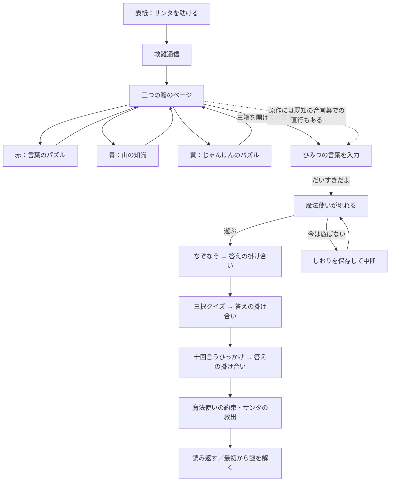

# サンタの脱出：全編の絵本版設計

2026-10-05作成の実装前の設計を保持した記録です。その後、日本語版の固定出題を実装しました。承認された高さの扱い・誤判定の修正と、現在の範囲は [実装記録](../prototype/FULL-GAME-NOTES.md)、確認範囲は [全編QA](../prototype/FULL-GAME-QA.md) を参照してください。以下の未確定事項は設計時点のものです。

**原作の救出まで、話と操作がつながる構成にできる。ただし、旧い知識の扱い・後半の正誤判定・読み上げと画面の同期を決めずに、現行の赤い箱画面を横に増やすだけでは不整合が生じる。** 以下は、その不整合を避けるための推奨仕様。原作の事実、ブラウザ向けの提案、未確定事項を区別した。

## 1. 原作を確認した範囲

GitHub公開版には原作ソース・Dialogflow原本のコピーを含めない。以下のローカル参照パスは調査時の記録。公開版では設計データと2,592経路のモデルを検査でき、原本との直接照合は別扱いにする。原本も照合した当時の結果は `FLOW-CHECK.json` に保持する。

- 指定された [資産フォルダ](https://drive.google.com/drive/folders/132YrO9014fSFNUIkxig42PI4lvGC6LRG) をtakatama.app接続で読んだ。`index.js`、音声11点、画像1点、Dialogflow設定とintent58ファイルを一覧確認。必要な四つの魔法使いintentを読んだ。
- 原作コードは `prototype/reference/legacy-index.js`。以前取得したコピーを継続使用。今回のDrive一覧にある `index.js` は同じID、2021年1月の更新。今回そのファイル全文の再取得・ハッシュ比較はしていない。
- `design/reference/witch_usersays_ja.json` に原作の呼びかけ候補「ダイスキダヨ」「だいすきだよ」「大好きだよ」があり、合言葉を推測だけで補っていない。
- 同期資料のAGENTS.mdと、既存の調査レポート・集計JSONも確認。`sources/` や調査資料は読み取り専用。レポートの再発明案A/B/Cは仕様に採用しない。サブエージェント不使用。
- 参照コードの行番号は現在のコピーに対するもの。主な根拠：導入293–340、調査383–556、青の説明568–578、開箱579–645、合言葉737–758、魔法使い760–800、結末823–881、問題生成939–960、箱の自由順1112–1159、判定1202–1251、直接呼び出し1306–1314、後半1320–1519。

## 2. 物語の約束と全体の流れ

サンタは魔法使いのいたずらで端末の中にいる。このままではプレゼントの準備が間に合わない。三つの箱の文字を集めて呼びかけると、現れるのは魔法使い。魔法使いは「遊んでくれたらサンタを自由にする」と約束し、三つの遊びの後、サンタを解放する。いたずらの理由は寂しさだったと分かる。

前半の成功条件は箱の正解。後半の約束は魔法使いと遊ぶこと。原作の後半は正解数を救出条件にしていない。この違いを保つ。全問正解を求める改変や、敵を倒す演出は入れない。



原作には合言葉が分かれば箱を開けずに魔法使いを呼べる経路がある（`witch.json` に前提contextなし、コードにも開箱を必須にするguardなし）。ブラウザ版も「ひみつの言葉を伝える」を箱のページの副操作として用意し、この経路を保持する。三箱を開けるまで直行を禁止する仕様に変える場合は、原作からの変更として別途判断する。直行でも、未開箱の箱を開いたことにしたり、未取得の文字を授与したりしない。

## 3. 謎・手がかり・判定の対応

| 区間 | 原作の手がかりと答え | 操作／結果 |
| --- | --- | --- |
| 赤 | 四桁のカギ → 言葉 → たぬきの絵 → 「たぬき」の「た」にバツ。サンタ=3、イタチ=1、ハタチ=8 | 調査を求めた段階だけ開示。初期全編版は現行の3138を維持。正解で「す」「だ」 |
| 青 | 四桁のカギと絵 → 山 → 「サガルマータ」 → 「その高さは、この端末が知っている」 | 調査4で原作どおり「サガルマータについて調べる」。ゲーム内の固定資料と音声で説明。原作の答え8848。正解で「い」「よ」 |
| 黄 | 四桁のカギと絵 → 四つのじゃんけんの手 → 「負けるが勝ち」 → 「指の数があなたをみちびく」 | その手に負ける手の指の数。グー→チョキ2、チョキ→パー5、パー→グー0。正解で「き」「だ」 |
| 六文字 | 「す・だ・い・よ・き・だ」を並べ直してひみつの言葉 | 短い自由入力。「だいすきだよ」ほか原作の表記候補を受理し、魔法使い登場 |
| なぞなぞ候補1 | 「クリスマス」に隠れた生き物。リスとマスともう一つ | 自由入力。答えクマ。入力後に原作の答えを示す |
| なぞなぞ候補2 | 幼稚園・保育園・公園・動物園。サンタが入る「えん」 | 自由入力。答ええんとつ |
| クイズ候補1 | ツリーに飾る赤い玉：トナカイの鼻／太陽／りんご | 原作が三択なので三つのボタン。答えりんご |
| クイズ候補2 | トナカイの数：三匹／六匹／九匹 | 原作が三択なので三つのボタン。原作の答え九匹、ルドルフを含む説明も維持 |
| クイズ候補3 | 豪州のクリスマス：ホット／グリーン／ブルー | 原作が三択なので三つのボタン。原作の答えグリーン。本文の一般化の強さは後述 |
| 最後 | 一緒に「シカ」を十回言う → サンタが乗ってくるのは？ | マイク不要。一緒に言うのは任意。短い自由入力。答えソリ。その後に救出 |

赤の候補は3138・3183・3813・3831。黄は最初の三つの手の全順列と、最後のいずれかの手からなる18候補。0で始まる正解もあるため、数字を数値型に変換しない。候補・正解・文字の対応は `full-game-spec.json` に記録した。

最初の全編実装は、音声を照合しやすい固定出題を推奨する。赤3138、黄「グー・チョキ・パー・グー」→2502、なぞなぞ「クリスマス」→クマ、クイズ「赤い玉」→りんご、最後はソリ。すべて原作にある組み合わせ。原作の候補銀行は保存し、全編の動作と音声を確認してから出題の変化を戻す。変化を戻す場合は新規開始時だけ選び、再開・調査・聞き直しで問題を再抽選しない。

赤と黄に独立したヒント台詞はない。追加調査がヒントとなる。青の説明だけは専用の応答がある。後半も、最初から正解を示す新しいヒントは追加しない。必要ならプレイ観察後の追加案として分ける。

## 4. 絵と操作の配置

絵本の見た目を保ち、スマホでは「絵を見る・音を聞く・手を動かす」が近くにあるようにする。PCでは絵と本文の見開き、スマホでは絵＋その場の操作＋本文という順。全文を読み進める人と音声を聞く人のどちらも、必要な操作を見つけられる構成にする。

| ページ | 絵の役割 | 主操作の位置 |
| --- | --- | --- |
| 導入 | 原作どおり端末の中のサンタ。森は装飾 | 絵の下に「はい、箱を調べる」。本文は続けて読める。音声終了待ちは必須にしない |
| 三箱 | 三つの箱そのものを大きな選択面にする。装飾と選択用に箱を二重表示しない | 箱の絵＋色名＋「調べる」を一つのボタンにする。開封済みは紙を見る操作へ |
| 各箱 | 調べた段階までの書き込みと絵。カギも同じ操作領域にある | 絵の直下に具体的な「書き込みを調べる」「絵を調べる」等。カギの操作を続けて置く |
| 六文字 | 原作の六枚の紙を、箱との対応を残して並べる。追加のカードゲームではない | 同じ領域に自由入力と「言葉を伝える」。ドラッグは必須にしない |
| 魔法使い | 箱が消え、端末と魔法使いの紙の仕掛けへ。敵や新しい部屋は追加しない | 「一緒に遊ぶ」「今は遊ばない」を絵の近くに置く |
| 問題 | 魔法使いの表情と紙の舞台。答えを先に描かない | その問いの下に自由入力／原作の三択。回答反応の後に「つづきを読む」 |
| 救出 | 端末の境界からサンタが外へ出る動き。閉じ込められた場所を屋外等にすり替えない | 結末の後に読み返す／解き直す。未実装の続編へ誘導しない |

主操作は小さな鍵や絵の隅を探してタップさせない。本文はいつでも開け、音声オフを選んだ場合は全文を表示する。画面下に常時固定するのは必要な場合の同じ操作への近道であり、すべてのページに汎用「次へ」を重ねない。ソフトキーボード表示中も、入力欄・確定・反応が見えることを実機で確認する。

鍵は四つの数字窓を持つダイヤル錠。上下ボタンで桁を回し、変化を短い動きで示す。「数字を直接入力する」入口も明示する。スワイプ／ドラッグを唯一の入力方法にしない。0〜9の自由な組み合わせを受け、最後に「鍵を試す」。空の直接入力は開箱せず入力案内へ。初期ダイヤルの0000を試すことはできるが、原作の候補に0000の正解はない。

### 絵が答えを漏らす箇所

- 赤：見ていない段階のたぬき・バツを描かない。字幕を勝手に「三・一・三・八」に置き換えない。
- 青：調査3までサガルマータを表示しない。説明を求める前にエベレスト名や標高を背景へ書かない。
- 黄：相手の手と負ける自分の手を、解答前に自動で並べない。指の数の数字ラベルも追加しない。
- 「クリスマス」のなぞなぞ：クマの絵や正解の文字の強調を先に出さない。
- 三択問題：りんご、九頭のトナカイ、サーフボードを問いの背景へ先に描かない。
- 最後：ソリを背景・アイコン・入力例・読み上げ操作のラベルに先に出さない。問いの字幕は原作の言葉のまま。答えの説明と絵は回答後。

## 5. 状態と戻る操作

必要な状態だけを固定ロジックで持つ。汎用ゲームエンジン・アカウント・サーバー・DB・実行時AIは不要。

```text
saveVersion / scenarioVersion
phase: cover | intro | boxes | boxResponse | spell | witchInvite | witchPaused
       | witchQuestion | witchResponse | rescue | complete
selectedBox: null | red | blue | yellow
boxes[color]: examined(0..4), opened, draftDigits, lastSubmittedDigits
questionSet: redWords, yellowHands, riddleId, quizId, trickId
spellDraft
witch: questionIndex(0..2), draft, responses[], declined
lastSceneId / boxResultToReview
settings: muteAll, voiceEnabled, bgmEnabled, sfxEnabled, transcriptOpen
readback: completedRunの選んだ問題・実際の経路
```

文字の所持状態は箱のopenedから導出する。赤の「だ」と黄の「だ」は別の紙IDで管理し、字が同じだからといって一枚にしない。開封済み箱を何回見ても紙は増えない。

| 操作 | 状態の更新 | 守る条件 |
| --- | --- | --- |
| 箱を選ぶ／別の箱へ | 選択箱だけを変える。未訪問なら調査1 | 他箱の調査・入力・開封を保持。好きな順に選べる |
| 調べる | 選択箱の段階だけ一つ増やす、上限4 | 聞き直し・箱への再訪は段階を増やさない |
| 四桁を試す | 正解ならその箱だけopened=trueを即保存 | 空、不正形式、不正解、他箱の答え、二重送信では開けない |
| 正解の反応から続ける | 未開箱があれば箱のページ、全部開けば六文字 | 最後の箱の開封反応を見ないまま合言葉へ自動で飛ばさない |
| 合言葉を伝える | 正しい表記ならwitchInvite、誤りなら同画面 | 初期仕様では原作の直行経路も許可。紙の取得状態を偽らない |
| 魔法使いの誘いを断る | witchPausedを保存。サンタは未救出 | 再開で同じ誘いへ。消えた箱に戻す操作は出さない |
| 魔法使いに回答 | 非空の回答を一回だけ記録しwitchResponseへ | 原作どおり正誤どちらも答えを示す。空のまま進めない |
| 反応から続ける | 次の問い、三問目の反応後はrescueへ | 回答連打で二問飛ばさない。音声の終了イベントで次へ進めない |
| 救出から結末へ | completeを保存 | 三つの回答・反応を経た後。未開箱の直行経路も原作どおり救出可能 |
| リセット | 確認後に進行・入力・選択問題を新規にする | キャンセルで保持。設定は保持。読み返し中に元の進行を書き換えない |

初回プレイの「戻る」は箱のページや既出の手がかりへ戻る操作。後半の回答を巻き戻すページ送りにはしない。回答反応中は次の回答欄を出さない。問題IDと画面IDをイベントに持たせ、古い画面の送信を無視する。

再読み込み後は表紙の「続きから遊ぶ」が再生の起点。保存直前の状態と問題を復元し、音声位置は戻さず、その台詞を最初から聞く。正解・回答結果は先に保存し、音声や演出の成功を保存条件にしない。データ不整合は未取得の紙や救出を生成せず、復旧／リセットの操作を示す。

## 6. 後半の判定と言葉の扱い

数の入力はNFKCと空白除去後、四桁の数字文字列として判定する。言葉はNFKC、前後・間の妥当な空白、ひらがな／カタカナの表記、原作に明記された漢字候補を扱う。生成AIによる意味推定はしない。

原作の `isRight` は文字列の部分一致なので、「そりじゃない」のような否定でも正解扱いになり得る。ブラウザでは短い入力を前提に、正規化した候補との完全一致にすることを**修正案**として記録する。自由入力を三択にする変更ではない。正誤は「その通り！」を付けるかどうかに使い、進行条件にはしない。

さらに原作のソリの回答候補には「ソリティア」が明記されている。誤登録の可能性が高いが、意図を断定できない。設計の照合データには残し、削除は未承認の修正案とする。チェック用モデルは原作の候補を維持している。

原作の不正解後に出る正解説明はそのまま。答えを見たくない人へ後から再試行の仕組みを付ける場合は、原作と違う遊びになるので今回の標準仕様にしない。「わからない」を自分で入力しても、一回の回答として原作の説明へ進める。沈黙には制限時間を設けない。

## 7. 声・BGM・効果音

音源の到達性と利用条件は [AUDIO-ASSET-AUDIT.md](AUDIO-ASSET-AUDIT.md) に分けた。9参照URLはHEADで200。素材の全編聴取・デコード・スマホでの再生は今回未実施。

原作はBGMを発話と並列再生し、発話終了に合わせ2秒でフェードアウト、音量指定-20dB。導入はBGMを2秒先行、魔法使い登場は5秒、結末は3秒先行していた。常に大音量でループする仕様ではなかった。

推奨するブラウザ版は、声・BGM・効果音を別の音量経路にする。元の語りを守り、声の聞きやすさを優先する。BGMは同じ章で細かい調査ごとに冒頭へ戻さず、位置を保持して再生。語りが終わったら2秒程度で静かにし、考えている間は静けさを基本にする。魔法使いの登場でSpook4、救出でLaid_Backへ切り替える。元の先行時間は初回の演出案として試し、長く感じる場合はタイミングだけを調整して記録する。

- 「停止」は声・BGM・効果音・未実行の演出予約を止める。全体ミュートも同様。BGMだけのオフは音声設定内に置き、画面の操作数を増やしすぎない。
- 同時の語りは一つ。操作・ページ変更・聞き直しで古い再生と予約をキャンセルし、世代番号で古い終了イベントを無視する。BGMも一曲を基本にし、章切替の短いクロスフェードだけを例外にする。
- ページ非表示では停止し、戻ってきただけで勝手に語り出さない。開始・再開・聞き直し等のタップを再生の起点とする。
- ファイル読込失敗・音声未対応・デコード失敗でも文字と操作で進める。効果音の終了やBGMの準備を進行条件にしない。
- 旧Storageへの直リンクを本番の依存先にしない。利用条件を満たす確認済み音源を作品側に保存して配信。音源ダウンロードや効果音単体の再生を目的にしたUIは作らない。

### 台詞と効果音の二重読みを避ける

現行の正解WAVは表示用の「カチカチ」「カチャ」も声で読んでいる。原作SSMLではそこに実際のダイヤル音・解錠音が入る。効果音を足す際は今のWAVへそのまま重ねず、原作のSSMLから「spokenText」「displayText」「soundCue」を分ける。擬音の声と同じ効果音が二重にならないよう、新しい音声は必要な場面だけ制作する。

特に最後の問題は表示用textが「シカ、シカ...」と省略され、SSMLは十回の「シカ」を持つ。生成入力に十回を明記して、人が回数と発音を照合する。表示用本文だけを機械的にTTSへ流す方式では原作の仕掛けを再現できない。

入力数字を含む誤答音声は、全10,000通りを事前生成しない。同じ語り手による箱名の導入・0〜9の一桁音声・結果文を制作し、原作の文順で組み合わせる案を推奨する。短い数字連結の自然さをまず試聴してから採用。ブラウザ読み上げによる現行の補完は暫定として残せるが、声の変化があるため全編の品質基準を満たしたとはしない。台詞の数字部分を黙って削ることはしない。

開箱は、判定結果を先に保存し、ダイヤル音→数字を合わせた説明→解錠音とふたの動き→紙と原作の台詞を、一つの取消可能な演出順で扱う。音声オフでは短い開箱の動きと全文を表示する。「続ける」はいつでも操作でき、操作したら音と予約を止めて結果を確定表示する。再開時には保存済みの開箱結果を示し、再判定・紙の再授与はしない。

## 8. 原作の不整合と、決める必要がある点

| 論点 | 原作／確認した事実 | 推奨と扱い |
| --- | --- | --- |
| 青い箱の高さ | 原作の答え・説明は8848m。現在のネパール政府資料は8848.86m | 原作版は8848を維持し、「原作の時点の値を使う」を問題の操作説明に明記。現在の値を現行の知識として8848と断定しない。8849を正解にする場合は説明・四桁への丸めの手がかり・判定を一緒に変える改変案になる |
| 外部に調べに行くと違う答えになる | 原作の「この端末が知っている」は音声アシスタントへの問い。ブラウザにその機能はない | 原作の `sagarmatha` の応答を固定のゲーム内資料にする。インターネット検索や実行時AIを必須にしない。8849の入力時も責めず、原作の値を使う案内とこの調査へ戻せる |
| 後半の不正解でも進む | 原作は回答回数三回で救出し、答えを教える | 保持。正解必須への変更を勝手に行わない。採点表や全問正解したという表示は出さない |
| 部分一致／ソリティア | 否定でも「その通り！」になり得る。ソリティアが候補にある | 完全一致とソリティアの除外を修正案として提示。全編実装前に方針を確認する。今回の現行ゲームは変更していない |
| 合言葉の直行 | 箱の開封をチェックせずwitchへ進める | 保持。直接経路でも正常に中断・再開・救出できるよう独立して設計する |
| 再訪台詞 | 未使用の `revisit` は赤の紙を「だ・だ」と言うが、実際の赤は「す・だ」 | この未使用台詞を再開へ新規採用しない。保存した正しい状態と既存の場面を復元する |
| 10秒／十回 | なぞなぞには10秒の考え時間、最後の表示本文は省略、SSMLは十回 | 10秒を締切にしない。十回は音声へ明記。省略本文と音声用台詞を分けて照合する |
| 豪州のクイズ | 原作は雪が降らない豪州を一括りにし、サーフボードのサンタを一般化して語る | 原作の遊びとして維持する場合は解説が原作由来だと区別。普遍的な最新知識としての妥当性は今回の調査では確定していない。広く現代向け教材にするなら、この候補の使用・言い回しを別途検討する。初期全編版は原作の赤い玉クイズを使う |
| 結末の星・感想依頼 | `finalSmartPhone` は旧サービスへの星評価を求め、過去コードには感想送信もある | 救出の掛け合いは維持し、サービスの操作依頼はブラウザ向けに除外。原作の `final` の終了文を使う。新しい送信フォームは作らない |

エベレストの確認元：[ネパール観光局の2024年資料](https://www.tourismdepartment.gov.np/files/statistics/46.pdf)。知識問題の値を更新すると、原作の正解と手がかりに変更が生じる。原作を尊重する初期仕様は旧値の明示で整合を取る案であり、すでに実装済みではない。

## 9. 読み返したくなる仕掛けと実装の順序

読み返しの中心は、助けを求めたサンタが外に出て、魔法使いの寂しさが分かる掛け合い。解答を何度も入力させることを読書の条件にしない。クリア後は問題・答え・開箱・結末をページで前後し、音声も同じファイルを再利用する。開箱前の探索中は既出の手がかりを読み返せるが、未開示の解答場面へは移れない。

通常経路は、その回で選んだ箱の順と問題を保持。直行経路の読み返しでは、未体験の箱を「解いた」場面にしない。「箱から謎を解く」は新規プレイへの入口にする。読み返しはゲームの保存状態を変更しない。

実装順は次を推奨する。絵・新規音声の量を増やす前に、各段階のつながりを確認する。

1. 絵の近くの操作と四桁の鍵を、現行の赤い箱で確認。旧BGMを適切なクレジットと音量制御で試す。
2. 青・黄を足し、任意の順・箱への再訪・開箱結果・六文字・合言葉を無音でも通す。
3. 魔法使いの誘い・中断・三つの遊び・回答反応・救出を固定問題で通す。直行経路も別に確認。
4. 魔法使いの声、SSML由来の効果音順、十回の発話、結末を制作・聴取照合し、組み込む。
5. 読み返し・保存・再開、実機での鍵・キーボード・音量を確認してから、原作の問題候補による変化を戻す。

BGMや効果音を入れただけで声が聞きやすいとは断定しない。スマホ本体のスピーカーとイヤホン、静かな場と相談しながら遊ぶ場で確認する。音源にないクマ・山の答え等を生成AIに補完させない。

## 10. 破綻を防ぐための受入確認

### 設計データの確認

`node design/check-flow.mjs` はブラウザ版の代わりではなく、設計モデルの検査。赤4候補×黄18候補×なぞなぞ2候補×クイズ3候補×箱の6順序、計2,592経路について、正解・紙・合言葉・三問の遊び・保存復元を確認する。0を含む四桁、同じ「だ」の二枚、誤答・空・重複送信、原作の直行・中断・再開も確認する。

今回の実行で2,592経路が成功。そのうち0始まりの黄の解答を含む経路は864。問題本文・回答候補・赤の出題・数字対応・合言葉・十回の反復を原作と照合した。結果は [FLOW-CHECK.json](FLOW-CHECK.json)。これは実装後の画面・音・localStorageの動作確認ではなく、下記のブラウザ検証はすべて今後の受入条件。

### 全編を実装した後のブラウザ確認（未実施）

- 箱の全6順序、途中で別の箱へ移る、開封済み箱を見る、調査途中・数字途中の保存復元。
- 青の説明を求めず知識で解く／求めて解く、8849や8848.86の入力時に詰まらない案内。
- 黄で0始まりの解答、数字の直接入力と上下ボタンの一致、空・誤答・二重送信で誤開箱しない。
- 六枚の紙がそろう順番、二枚の「だ」、誤った合言葉で消えないこと、正しい表記揺れ。
- 魔法使いの誘いを断って再開、各問題の回答前・回答反応後に再開。誤答三回でも原作どおり救出。空・連打で救出しない。
- 十回の「シカ」が実際に十回。全文・入力例・背景で答えを先に明かさない。
- 音声中のページ変更、聞き直し、停止、ミュート、非表示で旧音声・効果音・演出が残らない。
- 音源404／読込失敗／読み上げ未対応／保存禁止でも、文字と操作で最後まで遊べる。
- 開箱・救出の途中で再読み込みしても結果が重複せず、誤って未開箱へ戻らない。
- スマホ実機で長文を読む、音声を聞く、キーボードを開く、相談しながら止める。PCのキーボード操作、タブレットの見開きも確認。
- 読み返しがクリア状態を壊さず、解き直しが新しい開始として動く。

実装上の正常動作はこの確認で確かめられる。一方、初見で迷わないか・謎の難しさが適切か・何度も読みたいかは人のプレイ観察が必要で、設計モデルの完走をその証明にしない。
