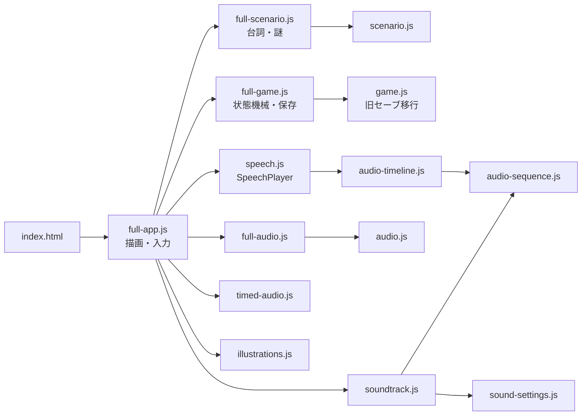
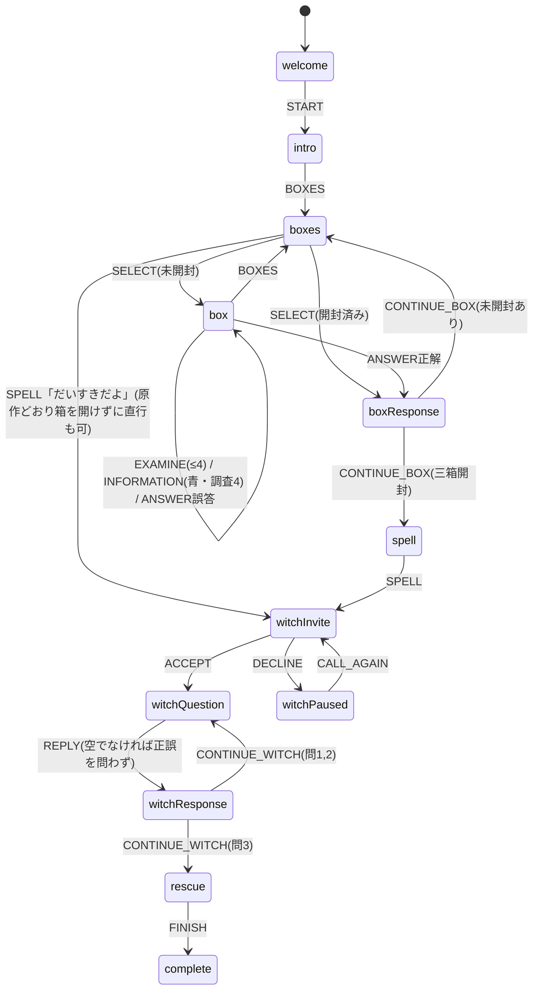

# 02 声の絵本プロトタイプ（`prototype/`、main）調査レポート

調査日: 2026-10-09 ／ 調査者視点: シニアフロントエンドエンジニア＋UXレビュー ／ 対象: `prototype/`（入口 `prototype/index.html` → `full-app.js`）
リポジトリの状態: `codex/illustrated-full-journey`（PR #1 head）をチェックアウト済み。PR #1 は `illustrated-prototype/` だけを追加しており（`git diff --name-only main...HEAD` で他ディレクトリの変更は0件）、`prototype/` は main と同一。

凡例: **【確認】** = コード・コマンド・実ブラウザで確かめた事実。**【推測】** = 根拠に基づく推論・評価。どちらも付いていない数値は計測値。

---

## 0. 要約（TL;DR）

1. **【確認】最後まで遊べる、本番公開中の日本語版。** https://santa-claus-escape.pages.dev/ は main のビルドを配信している（`sound-settings.js` のSHA-256がローカルと一致。main の `e4d225b` に Cloudflare Pages のチェックが success）。README の「Pagesへの実公開は利用者側で設定します」（README.md:67）は、すでに実施済み。
2. **【確認】技術の土台は堅い。** 依存ゼロのVanilla JS（ESM）。純粋関数の状態機械（12フェーズ、`revision` で古いイベントを拒否）と厳格なセーブ検証があり、取り消し可能な音声エンジン（声と効果音を同じ時計で鳴らすWeb Audioタイムライン）を持つ。`npm test` は46件中44件成功、2件スキップ（非公開の原作コピーとの照合）で、失敗は0件。
3. **【確認】声の資産は約17.5分ある。** Gemini TTS（`gemini-3.8-flash-tts`）で作った声のWAVが81本・1,052.5秒。三役の声種を分けている（語り=Sulafat、サンタ=Algieba、まほう使い=Leda。Ledaは三案の試聴から選定）。参考の生成費は全体で約0.28米ドル。**台本を書き直しても再生成のコストは障壁にならない。**
4. **【確認】資産は重く、整理されていない。** `prototype/` は89MB、`assets/audio` は77MB（WAV 83本・MP3 6本・OGG 2本）。どこからも参照されない孤立ファイルが15本・12.6MB、タイムラインに上書きされて実行時に使われないファイルが7本・7.4MB あり、どちらも本番に配信されている。OGG非対応環境向けのBGM用WAVは2本で25.6MB。全編を1回遊ぶと約31.5MBをダウンロードする（声は無圧縮の24kHz PCM）。
5. **【推測】親子で遊ぶアプリとしての最大の弱点は「大人が一人で読み操作する前提」の設計。** 根拠は次の3点。
   - 漢字が多くルビがない。台詞3,091字のうち漢字が436字（14%）、異なり字数は112字。
   - 文字が小さい。11px以下のフォント指定が64か所あり、「タップして調べる」は9px。
   - 入力が自由入力のかな（合言葉・なぞなぞ・最後の問題）で、画面には「原作のヒント」「原作時点の高さ」など開発者向けの言葉がそのまま出ている。

   子どもの役割（指で数える、声に出す、紙を並べる）がUIとして用意されていない。
6. **【推測】物語と謎の芯は親子向けにとても強い。** 次の要素は、新しいプロダクトでもそのまま主役にできる。
   - 手の中の端末にサンタが閉じ込められている、というメタな設定
   - 寂しかったまほう使い
   - 六文字を並べ替えた合言葉「**だいすきだよ**」
   - たぬき言葉（「た」抜き）
   - じゃんけんの「負けるが勝ち」を指の数で解く謎
   - 「シカ」を10回言わせるひっかけ問題
7. **【確認】PR #1 の Cloudflare プレビューは、声の絵本しか表示しない。** ビルドが `prototype/` だけを `dist/` に集めるため（`scripts/build-pages.mjs:4-5`）。`/illustrated-prototype/...` へのアクセスは SPA フォールバックで声の絵本の index.html が返る。PR #1 の絵本試作は、現状 Pages では見られない。

---

## 1. 調査範囲と方法

- 読んだ文書: `README.md`、`NOTICE.md`、`prototype/{README,FULL-GAME-NOTES,FULL-GAME-QA,STORYBOOK-QA,AUDIO-QA,QA,SOURCE-NOTES}.md`、`prototype/qa/FAIRY-VOICE-AUDITION.md`、`design/{AUDIO-ASSET-AUDIT,AUDIO-REVIEW-2026-10-06,AUDIO-TIMING-NOTES,BGM-VOLUME-CONTROL,ORIGINAL-AUDIO-RESTORATION,FULL-GAME-DESIGN,README}.md`、`docs/CLOUDFLARE-PAGES.md`。
- 読んだコード: `index.html`、`full-app.js`、`full-game.js`、`full-scenario.js`、`scenario.js`、`full-audio.js`、`audio.js`、`speech.js`、`audio-sequence.js`、`audio-timeline.js`、`timed-audio.js`、`soundtrack.js`、`sound-settings.js`、`illustrations.js`、`styles.css`、`serve.mjs`、`scripts/build-pages.mjs`、`scripts/check-pages.mjs`、`scripts/check-publication.mjs`、`prototype/scripts/{generate-audio,fairy-production-plan}.mjs`、`tests/full-game.test.mjs`（一部）、`.github/workflows/verify.yml`。
- 実行したこと（すべて読み取り専用。リポジトリ内のファイルは変更していない）:
  - `npm test`、`npm run check:design`、`npm run check:audio`、`npm run check:publication`。`npm run build` は `dist/` を書き出すので実行していない。
  - ローカル開発サーバー（`prototype/serve.mjs`）を Browser ペインで開いた。375×812 で表紙 → 導入 → 三つの箱 → 赤い箱の調査3 → 誤答0000 → 正解3138 の開箱まで実際に操作した。そのあと localStorage に途中状態を書き込んで再開し、まほう使いの問題画面と救出画面も表示した。最後に1280幅で見開き表示を見た。ブラウザ内の保存は最後に消去。
  - スクラッチパッドのNodeスクリプトで、音声の参照関係・WAVの長さ・台詞の字数・漢字率を算出した。
  - takatama アカウントのトークンで GitHub API を読み取り専用で参照（デプロイ、チェック結果、PRコメント）。本番URLとプレビューURLへ `curl` で読み取りアクセス。

---

## 2. 検査の実行結果

| コマンド | 結果 |
| --- | --- |
| `npm test` | **46件中、成功44・スキップ2・失敗0**（約0.52秒）。スキップした2件は「全編の主要な原作台詞と正解を原本と照合する」「原作の出題候補と正解対応から3138を導き、台詞を照合する」で、理由は「原本コピーは非公開」。 |
| `npm run check:design` | 設計モデル **2,592経路**、先頭が0の経路864、アサーション353,838件が成功。原本との照合はスキップ。※ 原作の問題群（ランダム出題）のモデルであり、実装中の固定出題UIの検査ではない（出力の `scope` にもそう明記されている）。 |
| `npm run check:audio` | 声のWAV **81本・合計1,052.5秒**。RMSは−23.7〜−13.3 dBFS、クリップしたサンプル0。TTSのトークンは入力21,415・出力30,333で、参考額は0.2837米ドル（標準単価での試算。実請求ではない）。 |
| `npm run check:publication` | Git管理下の公開ファイル617件。MIT、非公開資料なし、認証情報らしき文字列なし。 |
| CI（`.github/workflows/verify.yml`） | push/PR ごとに test → check:design → check:audio → check:publication → build → check:pages を実行。main の `e4d225b` で `verify` は success。 |

**【確認】** テストはすべてNode上で、DOM・Audio・AudioContext は代替オブジェクト（モック）。**実ブラウザでのE2Eテストはない**（Playwright等の依存もない）。QA文書の記録では、終盤の実画面操作は途中で止まっている（「ここでブラウザ操作がセキュリティポリシーに拒否されたため、終盤の実画面操作を中断した」FULL-GAME-QA.md:81）。実機スマホでの聴取と、子どもを含む初見プレイテストは一度も行われていない（QA.md:65-67、STORYBOOK-QA.md:26-27、FULL-GAME-QA.md:101-103）。

---

## 3. アーキテクチャ・マップ

### 3.1 モジュール一覧

コードは圧縮に近い密度で書かれている（`full-app.js` は171行・23KB、最長の行は2,508文字）。

| ファイル | サイズ | 役割 |
| --- | ---: | --- |
| `index.html` | 2.0KB | 外枠。`#app` に全画面を描画する。`#audio-host`・`#music-host` はAudio要素の置き場。リセット確認の `<dialog>`（index.html:14-27）。 |
| `full-app.js` | 23.1KB | UI全部。テンプレート文字列 → `app.innerHTML` で毎回すべて描き直す（full-app.js:101）。クリックは委譲で受ける（:134-167）。450msの連打防止（:119, :153）。タブを隠すと停止（:170）。 |
| `full-game.js` | 12.8KB | 純粋関数の状態機械 `transition`（:24-71）、読み返し用の履歴（:17-23）、セーブの厳格な検証（:77-102）、旧セーブの移行（:103-119）、表記の正規化（:5-7）。 |
| `full-scenario.js` | 13.0KB | 台詞・謎・正解（:4-39）、フェーズから場面への対応 `sceneFor`（:43-84）、収録対象の一覧 `productionScenes`（:86-101）。 |
| `scenario.js` | 3.5KB | 旧赤箱版の台詞（導入・説明・赤1〜4）。全編版が再利用。 |
| `full-audio.js` | 1.3KB | 場面キー → WAVの対応表（41キー）と、誤答の四桁を「前置き＋数字×4＋定型句」に分解する処理（:14-19）。 |
| `audio.js` | 0.7KB | 旧赤箱版の8クリップの対応表（全編版は intro/help/red1-4 を再利用）。 |
| `speech.js` | 5.1KB | `SpeechPlayer`。三段のフォールバック（タイムライン → 単一ファイル → Web Speech）と、世代番号による取り消し。 |
| `audio-sequence.js` | 3.7KB | Web Audio。複数WAVの読み込み・デコード・無音の切り詰め・結合（`joinAudioBuffers` :2-20）。 |
| `audio-timeline.js` | 3.2KB | 声と効果音を別バッファに組み、同じ `currentTime` で同時に開始する（:23-47）。 |
| `timed-audio.js` | 2.1KB | 原作SSMLの順番を再現したタイムラインの定義（開箱・誤答・登場・救出）（:19-29）。 |
| `soundtrack.js` | 4.1KB | BGM（MediaElementSource → GainNode）、2秒フェード、効果音、ダイヤル音。 |
| `sound-settings.js` | 0.4KB | BGM音量の初期値25%、最大ゲイン0.025。 |
| `illustrations.js` | 5.9KB | 絵（インラインSVGの文字列とCSS部品）。 |
| `styles.css` | 32.8KB | 紙のジオラマ、見開きと一ページの切り替え、アニメーション5種。 |
| `serve.mjs` | 3.0KB | 開発用の静的サーバー。許可リスト方式で、Rangeに対応。 |
| `app.js` / `game.js` | 17KB / 3.6KB | 旧赤箱版。`game.js` はセーブ移行のため今も読み込まれている。`app.js` は配信しない。 |



### 3.2 状態機械

**【確認】** フェーズは12個（full-game.js:76）。状態の変更は必ず `transition(state, event)` を通り、`event.revision` が現在の `state.revision` と違えば何もしない（:25）。遷移が成功するたびに `revision+1` して `remember()` で履歴を追加する（:70）。



- 設定系のイベント（`MUTE`/`BGM`/`SFX`/`TRANSCRIPT`/`BGM_VOLUME`）と入力系のイベント（`DRAFT`/`MODE`/`DIAL`）は `revision` を進めない（:26-45）。
- 後半の三問は**正誤に関係なく進む**（原作どおり。:63-68）。正解のときは「その通り！」が付く（full-scenario.js:79）。
- 合言葉は「表記を正規化した完全一致」（NFKC、空白除去、カタカナ→ひらがな、小文字化。full-game.js:5-7）。正解は `['だいすきだよ','大好きだよ']`（:59）。
- 箱の正解: 赤3138、青8848、黄2502（full-scenario.js:5-7）。問題は固定で、原作の問題群からのランダム出題はない（README.md:5）。

### 3.3 保存形式

**【確認】** localStorage のキーは `santa-claus-escape:ja-full:v2`（full-game.js:4）。旧赤箱版のキー `santa-claus-escape:original-red:v1`（game.js）からの移行がある（full-game.js:107-116）。

```jsonc
{
  "version": 2, "phase": "boxes", "revision": 2,
  "selectedBox": null, "boxMessage": "",            // "" | "wrong" | "information"
  "boxes": { "red": { "exam": 0, "opened": false, "draft": "", "dial": "0000",
                      "inputMode": "dial", "lastSubmitted": "" }, "blue": {…}, "yellow": {…} },
  "spellDraft": "", "questionIndex": 0, "questionDraft": "",
  "responses": [ { "id": "christmas-creatures", "input": "くま", "correct": true } ],
  "reinvited": false,
  "muted": false, "bgmEnabled": true, "bgmVolume": 25, "sfxEnabled": true, "transcriptOpen": true,
  "history": [ { "phase": "box", "box": "red", "exam": 3, "message": "", "digits": "",
                 "opened": [], "questionIndex": 0, "reinvited": false, "id": "box:red:3::0:false" } ] // 最大64件
}
```

- `restoreState`（:77-102）は整合性をかなり細かく検査する。開封済みなのに `lastSubmitted` が正解でない、救出済みなのに回答が3件ない、履歴に未開封の箱が含まれる、といった状態は**丸ごと拒否**する（不正な状態から復元しない）。拒否された場合は新規開始になる。
- 誤答は履歴に残らない（:19）。読み返しは「訪れた正しい場面」だけを、最大64ページで再生する。
- 音声の再生位置は保存しない。再開すると、その場面の台詞を最初から聞く。

### 3.4 描画方式（絵はSVGかCSSか）

**【確認】ラスター画像はゼロ。** `prototype/assets/` には `audio/` しかない。絵の作り方は次のとおり。
- **インラインSVG（5点）**: サンタ（illustrations.js:2-13）、たぬき（:15-21）、もみの木（:23-25）、山（:47）、まほう使い（:48）。どれもフラットな紙の切り抜き風で、表情・ポーズの差分はない。
- **CSS部品**: プレゼント箱は `<span>` を7つ組み合わせて作る（:27-30）。開くとふたが外れ、紙が2枚出てくる（`box-open`・`paper-rise` のkeyframes、styles.css:7）。
- **ジオラマ**: `winterScene()`（:32-41）は、夜空・月・星・雪原・紙の木6本を `perspective:900px` の固定カメラで重ねたもの（styles.css:5）。**導入・箱・まほう使い・救出のすべての場面が、この1枚の背景の中央に置く小道具を替えるだけ**で成り立っている。
- アニメーションはページの到着（`page-arrive`）、木が起き上がる（`paper-unfold`）、箱が開く、紙が上がる、声の波形（サンタの端末が `speaking` 状態のときだけ）の5種。`prefers-reduced-motion` で全停止（styles.css:13）。
- レイアウト: 801px以上は左に絵、右に本文の見開き。800px以下は一ページで、絵 → 操作 → 本文の順。音声ツールバーはスマホで `position:sticky`（styles.css:10）。

### 3.5 音声パイプライン

**【確認】** 再生の経路は3つある。

```mermaid
flowchart TD
  K[場面キー sceneFor().key] --> T{resolveAudioTimeline(key)?}
  T -- 開箱/誤答/登場/救出 --> TL[AudioTimeline: WAV/MP3をfetch→decode<br>声バッファ+効果音バッファを同時刻start]
  T -- それ以外 --> C{resolveAudioClip(key)}
  C -- 文字列 --> HA[HTMLAudioElement 1本<br>#audio-host]
  C -- 配列 --> SEQ[AudioSequence: 結合して1バッファ]
  TL -- 失敗 --> WS[Web Speech API ja-JP<br>rate 0.93, サンタpitch 0.85]
  HA -- error/play拒否 --> WS
  SEQ -- 失敗 --> WS
  WS -- 未対応 --> TXT[字幕だけで続行]
  BGM[Soundtrack: Laid_Back / Spook4 OGG<br>→ MediaElementSource → Gain 0.00625] -.声の再生中だけ鳴り、終わると2秒でフェードアウト.-> OUT((出力))
```

- **取り消し**: 新しい再生・停止・ミュート・画面の切り替え・タブの非表示があると、`generation++` して古い `onended` や読み込み完了を無視する（speech.js:18-32、audio-sequence.js:25-29）。予約済みの効果音も破棄する。
- **タイムライン**（timed-audio.js:19-29）。原作SSMLの順番を再現している。
  - 正解: ダイヤル音（原音4.15秒）→ 1秒 → 「あなたは赤色の箱の数字を／さん／いち／さん／はち／に合わせました。」→ 0.5秒 → 解錠音 → 「赤色の箱が開きました！」→ 正解音 → 紙の説明。
  - 誤答: ダイヤル音 → 1秒 → 数字 → 1秒 → 「あれれ？箱は開きませんでした。」→ 不正解音。
  - 救出: まほう使い「うふふ。ああ楽しかった！」→ 0.5秒 → 救出音 → 「端末の中からサンタがあらわれました。」→ 0.5秒 → 会話（37.4秒）→ 1秒 → 結び（6.4秒）。
- **音量**: 声1.0、効果音0.18、不正解0.10、ダイヤル0.12、解錠0.14（timed-audio.js:15-17）。BGMは最大ゲイン0.025 × 初期値25% = **0.00625（≈−44 dB）**（sound-settings.js:2-7）。スライダーを100%にしても0.025（≈−32 dB）。
- **BGMの鳴り方**: 状態表示が「読み上げ中」以外に変わると `track.quiet()` で2秒フェードして一時停止する（full-app.js:27、soundtrack.js:34-37）。**台詞を聞いている間だけ小さく鳴り、考えている間は無音**。原作の「声の終わりに合わせ2秒フェード」を再現したもの（AUDIO-ASSET-AUDIT.md:55）。
- **【推測】BGMは事実上ほとんど聞こえない可能性が高い。** 原作の指定（−20 dB）より初期値で約24 dB小さく、スマホのスピーカーでは声の下に埋もれると考えられる。実機での聴取記録はない（BGM-VOLUME-CONTROL.md:29）。
- **【推測・要実機確認】iPhoneのマナーモード問題。** iOS Safari では、マナースイッチがオンのとき Web Audio の出力が鳴らないことが知られている。この実装は、開箱・誤答・登場・救出の声と、BGM（MediaElementSourceでWeb Audio経由）だけが Web Audio を通る。そのため、ほかの場面の声は鳴るのに、開箱の瞬間やBGMだけが無音になるという混在が起きうる。`navigator.audioSession` などの対策コードは見当たらない。

---

## 4. 画面ごとのUXフロー

秒数はWAVの実測値。文字数は字幕の文字数。

| # | フェーズ | 絵（中央の小道具） | 主な操作 | 声（秒）／字幕（字） |
| --- | --- | --- | --- | --- |
| 0 | 表紙 `welcome` | 端末の中のサンタ | 「サンタを助ける」。保存があれば「続きから遊ぶ」「最初からやり直す」 | 自動では再生しない（タップが起点） |
| 1 | 導入 `intro` | 同上。声の波形が動く | 「はい、箱を調べる」（声の途中でも押せる） | 32.4秒／169字。「おー、そこの君！わしをここから出してくれんかの！」 |
| 2 | 三つの箱 `boxes` | 三色の箱ボタン、集めた紙 | 箱をタップ。折りたたみの「ひみつの言葉が、もう分かったら」 | 初回は help 29.0秒／148字、2回目以降は「残りは青色と黄色の箱です。」3〜4秒 |
| 3 | 箱 `box`（調査1〜4） | 箱＋段階的な手がかり（赤: 言葉→たぬき→「た」に×、青: 山→サガルマータ→「その高さは、この端末が知っている」、黄: ✊✌✋✊→「負けるが勝ち」→「指の数があなたをみちびく」） | 「箱の書き込みを調べる」など。4桁のダイヤル（▲▼・44px）または直接入力、「カギを試す」、「三つの箱へ戻る」。青は調査4で「サガルマータについて調べる」 | 赤 16.6/14.6/18.1/26.4秒、青 15.4/10.9/13.0/30.4秒（＋情報15.5秒）、黄 16.6/21.4/18.2/25.0秒 |
| 3' | 誤答 | 同じ（箱は動かない） | 同じ画面で再挑戦 | タイムライン 約10秒。任意の四桁を収録済みの数字クリップで読み上げる |
| 4 | 開箱 `boxResponse` | 箱のふたが外れ、紙2枚（例「す」「だ」） | 「ほかの箱を調べる」／「ひみつの言葉を考える」 | タイムライン 約20〜25秒 |
| 5 | 合言葉 `spell` | 六枚の紙（す・だ・い・よ・き・だ） | **かなの自由入力**「言葉を伝える」 | letters 30.4秒／130字（「スイカの『す』、大根の『だ』…」） |
| 6 | 登場 `witchInvite` | まほう使い（静止） | 「まほう使いと遊ぶ」／「いったん、しおりをはさむ」 | 登場音＋27.5秒／145字。「はーい！よばれて、とびでて、ジャジャジャジャーン！」 |
| 6' | 保留 `witchPaused` | サンタ | 「まほう使いを、もう一度呼ぶ」 | 29.8秒／148字 |
| 7 | 問題 `witchQuestion` ×3 | まほう使い | 問1「クリスマス」に隠れた生き物＝**自由入力**、問2 赤い玉＝**三択ボタン**、問3 シカ10回→サンタが乗るのは＝**自由入力** | 24.4秒／13.5秒／21.5秒 |
| 8 | 答え `witchResponse` ×3 | まほう使い | 「つづきを読む」／「まほう使いとの約束へ」 | 5〜11秒 |
| 9 | 救出 `rescue` | 端末の外に出たサンタ＋星 | 「絵本を閉じる」 | 約53秒（タイムライン）／256字。「だって、だって、さびしかったんだもの。」 |
| 10 | 完了 `complete` | 同上 | 「この絵本を読み返す」（前／次のページ、N / M）、「最初から謎を解く」 | — |

- **台詞の総量【確認】**: 全場面の字幕は3,091字。全部の調査と情報を見た標準的な一周（29場面）は、**声だけで約567秒（9.5分）・2,576字**。調査を省いた最短の一周（19場面）は約374秒。
- **タップ数【推測・計算値】**: ダイヤルの最短操作は赤9回・青10回・黄9回。最短クリアは約50タップと、かな入力3回（合言葉6字・「くま」・「そり」）。全部調べると約60タップ。
- **実ブラウザで観察したこと【確認】（375×812、Chromiumのエミュレーション）**
  - 表紙の開始ボタンは画面下端ぎりぎり。
  - 箱を選ぶ画面で「赤色の箱」などのラベルが箱の絵に重なって表示された。
  - 開箱後の「見つけた文字 2 / 6」が直下のボタンに接している。
  - 箱の画面では、カギを試すボタンが y=868〜914px（初期表示の外）、字幕（誤答の文章）が y≈1,247px と画面のかなり下にある。
  - 誤答のあとは `render(true,true)` でページ先頭に戻る（full-app.js:111）。スマホではダイヤルまでスクロールし直すことになる。
  - コンソールのエラーは0件。音声は導入 → help → red1-3 → 誤答の結合 → 開箱タイムラインの順に正しくfetchされた（206/200）。

---

## 5. 声のキャストと制作パイプライン

### 5.1 キャスト【確認】

| 役（字幕の表示名） | 声種 | 演技の指定（要約。原文は `scripts/generate-audio.mjs:12-16`、`scripts/fairy-production-plan.mjs:5-10`） |
| --- | --- | --- |
| 語り手（「端末からの声」） | Sulafat | 「温かく明瞭な案内の声。絵本を一緒に読んでいるように」「謎の言葉は一語ずつはっきり、解釈や答えを付け足さない」 |
| サンタ | Algieba | 「心優しい年配のサンタクロース。柔らかく落ち着いた低めの声」「大げさな物まね、怖い声、うなり声にしない」 |
| まほう使い（英語原作では fairy） | **Leda** | 「子どもっぽく無邪気で、少しいたずら好きな妖精」「怖がらせず、甘えたい気持ちをにじませる」。場面ごとの追加指定あり（保留は「少し残念そうに。怖い脅しにしない」、救出は「さびしかった気持ちから、遊べた喜びと素直なお礼へ」） |

- **選び方**: 当初はまほう使いも語り手と同じ Sulafat で、声が似ていた。そこで A=Leda、B=Zephyr、C=Puck の三案を同じ台詞113字で試聴し（比較用に平均RMSを−21 dBFSへそろえた派生ファイルで比べた）、オーナーがAを選んだ（qa/FAIRY-VOICE-AUDITION.md）。
- **生成の作法**:
  - API は `generativelanguage.googleapis.com/v1beta/interactions`、`store:false`。各場面を1回だけ生成し、自動での再試行はしない。
  - 三役が混ざる場面は「二話者以内」のまとまりに分けて生成し、制作時に280msの間を入れて結合する（FULL-GAME-NOTES.md:26）。
  - 受信したWAVは無加工で保存し、C2PAを保持する。入力全文・声・トークン・SHA-256を `reference/audio-generation/*.json`（87件）に記録している。
- **四桁の数字**: 原作の `say-as characters` に合わせ、生成入力では「3、1、3、8」のように一桁ずつ区切る（generate-audio.mjs:44）。
- **費用**: 参考額は全体で0.2837米ドル（check:audio の出力）。内訳は初回9本0.055、全編追加29本0.153、数字15本0.009、Leda本編15本0.050、タイミング用14本0.017（いずれも標準単価での試算）。

### 5.2 数字の結合（誤答を任意の四桁で読む）【確認】

- 誤答のキー `red-wrong-1234` を、`answer-prefix-red`「あなたは赤色の箱の数字を」＋ `answer-digit-1..4`（「いち」「に」…）＋ `answer-set`「に合わせました。」＋ `answer-closed`「あれれ？箱は開きませんでした。」に分解する（full-audio.js:8-19、timed-audio.js:18）。
- 結合処理は `joinAudioBuffers`（audio-sequence.js:2-20）。振幅0.001未満を無音とみなして前後を切り詰め、40msの余白を残し、80msの間でつなぐ。
- 収録済みの短いクリップ15本（色ごとの前置き3・数字0〜9の10・「に合わせました。」1・「あれれ？箱は開きませんでした。」1。一回の誤答で使うのは7本）で、**3色×10,000通り＝30,000通り**をカバーする（テスト済み、tests/audio-update.test.mjs:18）。人工的なつなぎ目の自然さは、人がまだ聴いて確認していない（FULL-GAME-QA.md:64）。

### 5.3 フォールバック【確認】

1. タイムライン（Web Audio）や結合再生が失敗すると、同じ台詞を Web Speech API で読む（speech.js:47, :56）。
2. 単一WAVの `error` や `play()` の拒否でも Web Speech に切り替える（:62-78）。読み上げは一文ずつキューに入れ、`ja-JP`、速さ0.93、サンタはピッチ0.85。四桁は「3、1、3、8」と区切る（:83-99）。
3. 読み上げに未対応なら「読み上げに未対応です。台詞を読んで遊べます」と表示し、字幕と操作だけで最後まで遊べる（:81）。

### 5.4 資産の量（du・本数）【確認】

| 対象 | サイズ／本数 |
| --- | --- |
| `prototype/` 全体 | **89MB** |
| `prototype/assets/audio` | **77MB**、93ファイル（WAV 83、MP3 6、OGG 2、JSON 2） |
| `prototype/qa`（スクショ12枚、試聴WAV、結合用の原音） | 11MB（配信しない） |
| `prototype/reference`（生成記録JSON） | 396KB |
| 声のWAV | **81本、1,052.5秒（17.5分）**、すべて24kHz・16bit・モノラル（48KB/秒の無圧縮PCM） |
| ├ 実行時に参照される声WAV | 66本、791.8秒 |
| ├ そのうちタイムラインに上書きされ**実際には鳴らない**もの | 7本、7.4MB（`ja-{red,blue,yellow}-open`、`ja-*-wrong-0000`、`ja-leda-rescue`）。失敗時のフォールバックは Web Speech へ直行するため、これらのWAVには到達しない（speech.js:47） |
| └ **どこからも参照されない孤立ファイル** | 15本、12.6MB（Leda採用前の `ja-invite`・`ja-paused`・`ja-question-*`・`ja-response-*`・`ja-rescue`、旧 `success-3138`・`wrong-0000`・`santa-sample`） |
| BGM | OGG 2本 3.85MB（原作のループ版、CC BY 4.0）。OGG非対応環境向けのWAV 2本 25.6MB（44.1kHz・ステレオ） |
| 効果音 | MP3 6本（ダイヤル CC0、解錠＝効果音辞典、正解・不正解・登場・救出＝効果音ラボ） |
| `dist/` に入る音声 | `assets/audio` の wav/mp3/ogg を**全部**コピーする（build-pages.mjs:5）。91本・約81MB。本番の `ja-rescue.wav`（孤立）も200で取得できることを確認 |
| 全編を1回遊ぶときのダウンロード【計算】 | **約31.5MB**（声WAV 27.2MB、OGG非対応環境ではさらに最大25.6MB）。キャッシュヘッダーは `max-age=0, must-revalidate`（本番で確認） |

【推測】声をAAC/Opusの32〜48kbpsに変換すれば、実際に使う約640秒は2.6〜3.8MB程度になる（現在の約1/8〜1/10）。

---

## 6. デプロイ・ホスティングの状態【確認】

- **本番**: https://santa-claus-escape.pages.dev/ がHTTP 200で声の絵本を返す（`<title>サンタの脱出 — 声と仕掛けの絵本</title>`）。本番の `sound-settings.js` はローカルとSHA-256が一致（`DEFAULT_BGM_VOLUME=25`）。main の `e4d225b` に Cloudflare Pages のチェックが success。GitHub の Deployments API は0件（Pages の GitHub App 連携のため）。
- **PR #1 のプレビュー**: Cloudflare のボットのコメントによると、ブランチプレビューは https://codex-illustrated-full-journ.santa-claus-escape.pages.dev 。ただし配信内容は**声の絵本**。`/illustrated-prototype/intro/index.html` も声の絵本の index.html を返す（404ページがないためのSPAフォールバック）。**PR #1 の成果物はPagesでは確認できない。**
- **ビルド**: `npm run build` は静的ファイル16本と音声を `dist/` に集める。CSP（`default-src 'self'` ほか）、`Permissions-Policy: microphone=()` などを `_headers` に書き、1ファイル25MiBの上限を検査する（build-pages.mjs:4-19）。外部依存・Functions・DBはない。
- **注意点**:
  - 本番・プレビュー・ローカルで localStorage は別々（docs/CLOUDFLARE-PAGES.md:35）。
  - 未知のパスにも200で index.html を返すので、リンク切れが表に出ない。
  - Production branch は `main`。PR #1 をマージしても、ビルドスクリプトを変えない限り `illustrated-prototype/` は公開されない。

---

## 7. 良い点と、将来のプロダクトで再利用できるもの

評価: ◎=そのまま使える、○=手直しして使える、△=考え方だけ使える。

| # | 資産 | 評価 | 根拠・使い方 |
| --- | --- | --- | --- |
| 1 | **物語の設定「手の中の端末にサンタが閉じ込められている」** | ◎ | 語り手は端末そのもの（「あれれ？私の中から声が聞こえます。」）。子どもにとって、持っているスマホが物語の舞台になる。プロダクトの体験の芯にできる。 |
| 2 | **合言葉「だいすきだよ」と、寂しかったまほう使い** | ◎ | 六文字（す・だ・い・よ・き・だ）を並べ替えて「だいすきだよ」が完成する。親子が互いに言い合える一言になる。救出の掛け合い（「だって、だって、さびしかったんだもの。」）で、悪役が「かまってほしかった子」だと分かる。大人が子どもと一緒に味わいたい情緒がここにある。【推測】 |
| 3 | **謎のうち、身体と声を使うもの** | ◎ | 黄の箱は相手の手に負ける手の指の数（2・5・0・2）で、子どもが自分の指を出して解ける。問3は「シカ、シカ…」を10回一緒に言わせるひっかけで、声に出す掛け合い遊びになる。赤の箱は「た」抜きのたぬき言葉で、小学校低学年でも大人のヒントがあれば解ける。【推測】 |
| 4 | 声のキャストと演技指定、試聴して選ぶプロセス | ◎ | 三役の声種を分けて「怖くしない」と指示した文言がそのまま使える。台本を変えても1本あたり数セントで再生成できる。 |
| 5 | 収録済みの声（実際に鳴る約640秒） | ○ | 台本を変えなければ再利用できる。親子向けに台本を書き直すなら、いずれ作り直しになる。 |
| 6 | 数字クリップを結合して任意の四桁を読む技法 | ◎ | 小さな音声資産で、入力した数字を物語の声で返せる。誤答にもキャラクターが反応している手応えが出る。 |
| 7 | 音声エンジン（世代番号での取り消し、声と効果音を同じ時計で鳴らすタイムライン、三段フォールバック） | ○ | 依存ゼロで約250行。モジュールごと移植できる。iOSのマナーモードと圧縮音声への対応を足す必要がある。 |
| 8 | 状態機械＋厳格なセーブ検証＋読み返し履歴 | ○ | `transition` は純粋関数でテストしやすい。「二重に授与しない」「古いイベントを拒否する」「途中から再開する」は、どんな新UIにも必要な性質。 |
| 9 | テスト46件（全六通りの箱順、連打、壊れたセーブ、取り消し、音声の順番） | ○ | 新しい実装でも、仕様の不変条件のリストとして使える。 |
| 10 | アクセシビリティの基本 | ○ | 制限時間なし（「考えている間に、先へは進みません。」）、字幕だけで最後まで遊べる、44pxのダイヤル、`role=status`、見出しへのフォーカス移動、reduced-motion 対応、Enterキー対応。 |
| 11 | 素材の出所とライセンスの管理 | ◎ | NOTICE.md と provenance JSON がそろっている。CC BY のクレジットはゲーム内に表示。効果音ラボ・効果音辞典の規約も確認済み。原作のジングルは条件を確認するまで同梱しないと判断している。 |
| 12 | 運用（CI、Pages、CSP、公開チェック） | ◎ | 静的ホスティングだけで完結していて、費用もほぼかからない。 |
| 13 | 紙のジオラマの絵（SVG/CSS） | △ | 統一感があり軽い（画像0バイト）。ただし表情・場面のバリエーションがない（§8.6）。 |

---

## 8. 親子体験としての弱点

想定する利用場面: 親1人と子ども1〜2人（4〜9歳）が、1台のスマホかタブレットを一緒に見る。深刻度: 高／中／低。

### 8.1 文字と読みのレベル — 高

- **【確認】** 字幕3,091字のうち漢字が436字（14.1%）、異なり字数は112字。教育漢字に入らない字（端・脱・込・隠・飾 など）を含み、**ルビ（`<ruby>`）は全くない**（full-app.js・illustrations.js・index.html で0件）。
- **【確認】** 字幕は最初から全文表示（`transcriptOpen: true`、full-game.js:9）。調査の台詞は前の段階の文をくり返して積み上がる。例: 青4は138字で「あなたは青色の箱を調べました。箱には山の絵がかいてあり、その横に『サガルマータ』と書いてあります。…」。
- **【推測】** 未就学〜小1は字幕を読めず、声を聞くしかない。ボタンの文言（「箱の書き込みを調べる」「四つの数字を合わせて、カギを試す」「進行をリセット」）も子どもには読めない。子どもが自分で押す理由が生まれにくい。

### 8.2 文字サイズとUIの密度 — 高

- **【確認】** styles.css の `font-size` 指定のうち **11px以下が64か所**（7px×4、8px×6、9px×11、10px×19、11px×24）。主な値は次のとおり。
  - 箱ボタンの「タップして調べる」: 実効9px（styles.css:16）
  - 「＋台詞を文字で読む」の切り替え: 10px（:3）
  - 誤答のフィードバック・考え中の注記: 11px
  - 本文（字幕）: 14〜15px
  - 主ボタン: 12〜13px
- **【確認】** スマホでは、音声ツールバー（聞き直す／停止／音声オン／状態表示／BGMスライダー／BGMオン）が上部に固定される（styles.css:10）。375×812では高さ約113px（画面の約14%）を常に占め、ボタンの文字は9〜10px。**大人向けの操作盤が、子どもに見せたい絵のすぐ上に居座っている。**

### 8.3 入力方法 — 高

- **【確認】** 合言葉・問1・問3は**かなの自由入力**（`wordForm`、full-app.js:66-68）。判定は完全一致（「くまさん」「そりだよ」は不正解扱い）。問1・問3は不正解でも進むので詰まりはしない。ただし「その通り！」がもらえず、子どもには理由が分からない。
- **【推測】** フリック入力ができない年齢では、親が代わりに打つことになる。合言葉の場面は「六枚の紙を並べる」という触って遊べる操作になるはずなのに、テキスト欄に置き換わっている。「シカ10回」も画面上は文字を読むだけで、一緒に声に出す仕掛けがない。
- **【確認】** ダイヤル（▲▼が44×62px）は子どもでも押しやすい。数字の直接入力（`inputmode="numeric"`）は大人向けで、両方あるのは良い。

### 8.4 テンポとペース — 中

- **【確認】** 標準的な一周で声は約9.5分（29場面）。救出だけで約53秒。声を最後まで聞かなくても次へ進める（進行は音声を待たない設計）。
- **【確認】** 操作のたびに全画面を描き直して先頭へスクロールする（full-app.js:111）。スマホで誤答すると絵の位置へ戻され、誤答の字幕は y≈1,247px にあって見えない。誤答の手応えは声と不正解音だけで、箱が揺れるなどの視覚的な反応はない。
- **【推測】** 「考えている間は無音（BGMが止まる）」は大人の謎解きには良い。一方、子どもには間延びした空白に感じられやすい。「親が説明し、子が答える」間を支える環境音や待機中の小さな動きがない。
- **【推測】** 章立て・区切りの演出がない。一晩10〜15分×数日に分けて遊ぶ想定になっていない（保存はあるが、「今日はここまで」の締めくくりがない。例外は、まほう使いの誘いを断る「しおり」の分岐だけ）。

### 8.5 謎の年齢適性【推測】

| 謎 | 子ども単独 | 親子 | 大人 | コメント |
| --- | --- | --- | --- | --- |
| 赤: たぬき（サンタ・イタチ・サンタ・ハタチ→3138） | × | ◎ | ○ | 「た」抜きは定番の言葉遊び。親のヒントがあれば小1〜2でも解ける。音から数字（サン・イチ・ハチ）を拾うのも良い。 |
| 青: サガルマータ＝エベレストの高さ8848 | × | △ | △ | 知識問題で、ゲーム内の「調べる」を押せば答えが出る。子どもは数字を写すだけになる。現在の公式値8848.86m（8849）を知る大人は誤答扱いになる（画面には「この謎は、原作時点の高さを使います。」と表示）。**親子向けでは差し替え候補の筆頭。** |
| 黄: じゃんけん「負けるが勝ち」指の数→2502 | △ | ◎ | ○ | 手を出して数える身体的な謎。親子で遊ぶのに最も向いている。 |
| 合言葉: す・だ・い・よ・き・だ→だいすきだよ | △ | ◎ | ○ | 感情面での最大の見せ場。並べ替えを触って操作できるUIにすべき。 |
| 問1: 「クリスマス」に隠れた生き物（クマ） | ○ | ◎ | ○ | 年中〜でも解ける。 |
| 問2: ツリーの赤い玉（りんご） | ○ | ○ | △ | 三択。知識クイズとして軽い。 |
| 問3: シカ10回→サンタが乗るのは（ソリ） | ○ | ◎ | ○ | 声に出す遊び。画面に「シカ、シカ...」と省略して表示するだけでは仕掛けが半減する（音声には10回入っている）。 |

### 8.6 絵の魅力と演出 — 中〜高

- **【確認】** 全場面が同じ雪のジオラマで、中央の小道具が替わるだけ。サンタとまほう使いは一枚絵で、表情・口パク・感情の差分がない。サンタは「いやー、こまった、こまった」の場面も救出の場面も同じ笑顔。まほう使いは「さびしかった」と言うときも笑顔。
- **【確認】** 演出らしい演出は箱が開く動きと紙が上がる動きだけ。救出の場面も、サンタの横に星が一つ増えるだけ（`rescue-spark`、illustrations.js:50）。
- **【推測】** 大人には上品で落ち着いた紙細工に見える。子どもが画面を見て「わあ」と声を上げる瞬間（キャラクターが動く、端末から飛び出す、雪が舞う、紙吹雪が出る）が足りない。
- **【確認】** 375pxでは、箱ボタンのラベルが箱の絵に重なる・「見つけた文字 2 / 6」がボタンに接する、という小さな表示崩れがある。

### 8.7 音の設計 — 中

- **【確認】** BGMの初期値は−44 dB相当で、声の再生中にしか鳴らない（§3.5）。効果音は原作の音源を原作の順番で鳴らしている。
- **【推測】** 声の品質は三役が分かれていて良い。ただし人が全編を聴いて確認したことはなく、誤読・不自然さのチェックが済んでいない（FULL-GAME-QA.md:34、FAIRY-VOICE-AUDITION.md 末尾）。BGMが聞こえないほど小さいため、クリスマスらしい華やかさや、場面転換の音の合図が弱い。

### 8.8 開発者向けの言葉が露出している — 中

- **【確認】** プレイヤーに見える文言に「原作」が5種類出る。
  - 「絵の下を調べる（原作のヒント）」「続きの書き込みを調べる（原作のヒント）」（full-app.js:85）
  - 「この謎は、原作時点の高さを使います。」（:86）
  - 「この謎は原作時点の値を使います。」（:124）
  - 「原作と同じく、箱を全部開ける前でも伝えられます。」（:79）
  - 三択のaria-label「原作の三つの答え」（:93）

  状態表示（「読み上げが終わりました」「音声を停止しました」）や、クレジット欄の「MIT対象外」「Gemini TTSで事前収録」も、子ども向けの物語世界の外側の言葉。
- **【推測】** オーナーが「原作への忠実さ」を強く重んじてきた経緯（9コミット中5件が原作音源の復元・順番の再現）がそのまま画面に出ている。親子向けにするなら、こうした記録は「大人向けの情報」へ隔離するべき。

### 8.9 一緒に遊ぶ仕掛けがない — 高

- **【確認】** 共同プレイに関する要素は、フッターの「ひとりでも、いっしょに考えても。」（index.html:21）と、回答欄の「時間制限はありません。ひとりでも、相談しながらでも。」（full-app.js:64）の文言だけ。
- **【推測】** 次の要素がない。
  - 役割の分担（子どもがタップや指の数を担当し、親がヒントを読む）
  - 親だけが見るヒントの段階（調査の4段階目はヒントではなく、原作の手がかり）
  - 子どもの名前で呼びかける
  - 遊び終わったあとに手元に残るもの（サンタからの手紙・証明書・画面写真・救出した日）
  - クリスマス当日までの日付と連動した仕掛け

  「大人が**ぜひ**子どもと一緒に遊びたい」と思わせる理由（思い出・会話・物語の続き）が設計されていない。

### 8.10 技術面で親子体験を損ねる要素 — 中

- 一周で約31.5MBの無圧縮WAVを取得する（§5.4）。【推測】帰省先や車内などのモバイル回線では、読み込みの遅れが声の遅れとして体感される。
- iOSのマナーモードで一部の音だけが鳴らない可能性（§3.5、要実機確認）。
- 実ブラウザE2Eと実機の検証が行われていない（§2）。
- 問題は固定でランダム出題がなく、2回目は答えを覚えている。【推測】兄弟で順番に遊ぶ・翌年も遊ぶ、といった再訪の価値が低い。英語版もない（README.md:5）。

---

## 9. 次のプロダクト設計への示唆（このプロトタイプの視点から）

### 9.1 残すもの・変えるもの・やめるもの【推測】

| 区分 | 項目 |
| --- | --- |
| **残す** | 端末にサンタが閉じ込められている設定と、端末そのものが語り手であること。まほう使いの寂しさと「だいすきだよ」。黄の箱・たぬき言葉・クリスマスのなぞなぞ・シカ10回。三役の声（Sulafat/Algieba/Leda）と演技指定。数字クリップの結合。制限時間なし・字幕だけでも遊べる方針。状態機械の不変条件とテスト。ライセンス管理。Pages＋CIの構成。 |
| **変える** | 次の項目を変える。<br>・ルビを付け、本文は16px以上・ボタンは18px以上にする。<br>・字幕は初期で閉じるか、要約1行にする。<br>・合言葉は紙を並べるタイル操作にし、問1・問3は選択式＋声に出して言う促しにする。<br>・誤答の反応を、カギの近くで視覚的に見せる。<br>・キャラクターの表情差分と演出を増やす。<br>・BGMの初期音量を上げ、待機中の環境音を足す。<br>・声をAAC/Opusに圧縮する。<br>・孤立ファイル（15本）と使われないファイル（7本）、BGM WAVの扱いを整理する。<br>・iOSのオーディオセッションに対応する。 |
| **やめる** | 次の項目をやめる。<br>・画面の「原作〜」表記とメタな状態表示を、子どもに見える場所に置くこと。<br>・青の箱のような、子どもが解けない知識問題（差し替えるか、親のヒントに回す）。<br>・操作のたびに先頭へスクロールすること。<br>・大人向けの音声操作盤を常に固定表示すること。 |

### 9.2 このプロトタイプを土台にした場合の方向性（比較用の材料）【推測】

| 案 | 内容 | 長所 | 短所・リスク | クリスマス（約11週後）までの見込み |
| --- | --- | --- | --- | --- |
| A. 声の絵本を磨く | 現行コードで §9.1 の「変える」を実施する | 動く本番がある。リスクが低い。声の資産をそのまま使える | 絵が単調で、「探索する楽しさ」は増えない。innerHTMLで全部描き直す設計に演出を足し続けると無理が出る | 高い（数週間規模） |
| B. 声の資産と状態モデルを、PR #1 の絵の探索に統合 | PR #1 の「絵の中を探索する動く絵本」に、本プロトタイプの声・音声エンジン・セーブ検証・テスト観点を移植する | 「見る楽しさ」（PR #1）と「聞く楽しさ」（本プロトタイプ）が両方そろう。親子で指さしながら遊べる | 二つの実装の統合コストがかかる。PR #1 は音声なしで設計されているので、場面と台詞を対応づけ直す必要がある。台本を変えるなら声を再生成（費用は小さい） | 中（範囲を絞れば可能） |
| C. 親子の役割を前提にした新設計 | 親の端末は「サンタの声を受信する装置」、子どもは手を動かす係、とはっきり分ける。日付連動の章立て（例: 12月の週末ごとに1箱）や、最後の手紙・証明書を加える | 「ぜひ一緒に」の理由をいちばん作りやすい | 新規の設計とプレイテストが必要。スコープが膨らみやすい | 中〜低（核に絞る必要あり） |

**【推測・提案】** 本プロトタイプの最大の価値は「声」と「物語の芯」であり、絵と操作は弱い。そのため **B（必要に応じてCの要素を少し足す）** が、資産を最も生かせる。最低限、Aの中の資産の軽量化・ルビ・文字サイズ・入力のタイル化は、どの案でも共通して必要。

### 9.3 着手前に確かめるべきこと

1. 子どもを含む実プレイの観察（一度も行われていない）。4〜6歳と7〜9歳で、どこで詰まるか・どこで笑うかを見る。
2. iPhone/Android の実機で、声の聞こえ方・BGMとの音量バランス・マナーモード時の挙動・読み込みの遅れ。
3. オーナーが「原作への忠実さ」をどこまで譲れるか。台詞の書き換え、青の箱の差し替え、問題の変更。過去の判断の傾向は、音源・順番では原作優先、台詞の短縮（開箱後の案内）では柔軟。
4. Pages で PR #1 の試作を確認できるようにするかどうか（ビルドスクリプトの変更が必要）。

---

## 付録A: 数値の一覧

| 指標 | 値 |
| --- | --- |
| テスト | 46件（成功44・スキップ2・失敗0） |
| 設計モデルの検査 | 2,592経路、アサーション353,838件 |
| フェーズ／イベントの種類 | 12／23（進行14・リセット1・設定5・入力3） |
| 台詞の総字数／漢字数／異なり漢字 | 3,091／436（14.1%）／112 |
| 最長の場面 | 救出 256字・約53秒、導入 169字・32.4秒、help 148字・29.0秒 |
| 標準的な一周の声 | 29場面・約567秒・2,576字 |
| 声のWAV | 81本・1,052.5秒（使用66本・791.8秒、実際に鳴るのは59本・約638秒） |
| 音声ファイル | 91本（WAV 83、MP3 6、OGG 2）＋JSON 2 |
| 容量 | prototype 89MB／assets/audio 77MB／qa 11MB／一周のDL 約31.5MB |
| 11px以下のfont-size指定 | 64か所 |
| TTSの参考費用 | 約0.28米ドル（全生成分） |
| mainのコミット | 9件（2026-10-05〜10-07） |

## 付録B: 主な根拠の行番号

- 描画と入力: full-app.js:69-108（render）、:101（innerHTML）、:109-112（apply → 先頭へスクロール → 読み上げ）、:118-132（submit）、:134-167（クリック委譲）、:170（タブ非表示で停止）
- 子どもに見える「原作」表記: full-app.js:79, :85, :86, :93, :124
- 状態機械: full-game.js:24-71、セーブ検証 :77-102、移行 :103-119、履歴 :17-23
- 台詞と謎: full-scenario.js:4-8（正解）、:20-33（台詞）、:35-39（三問）、:43-84（sceneFor）
- 音声: speech.js:39-115、audio-sequence.js:2-20、audio-timeline.js:2-47、timed-audio.js:15-29、soundtrack.js:29-46、sound-settings.js:2-7
- 絵: illustrations.js:2-50、styles.css:5（ジオラマ）、:7（keyframes）、:10（固定ツールバー）、:13（reduced-motion）、:16（箱ラベル9px）
- 公開: scripts/build-pages.mjs:4-19、scripts/check-pages.mjs:14-24、prototype/serve.mjs:9-35、docs/CLOUDFLARE-PAGES.md、.github/workflows/verify.yml
