# 枝・縮尺・人物の追加修正

2026-10-07。全編ラフを見たユーザーの指摘を受けた追加修正。独立フォルダだけを変更し、既存ゲーム・紙/Three.js試作・元の参照画像は変更していない。4190番の既存静的サーバーを利用し、4186番は操作していない。

## 表現の判断と実装

| 指摘 | 今回の判断・変更 |
| --- | --- |
| 魔法使いの登場時だけ枝がある | 閉じた枝を冒頭〜合言葉にも配置。発見で開き、会話・救出・結末でも開いた枝を端に残す。動かす仕掛けを全場面で反復するのではなく、同じ物がそこにある状態を保つ |
| 外か、家か | 今回は深い青と金色の発見が成立している雪の森を継続。家なら暖炉・卓上の箱・窓のまとまりが作りやすいが、枝を開く発見を窓や戸などへ設計し直し、背景素材も再制作する必要がある。屋内への変更は未採用 |
| 箱が出ると背景のサイズが変わる | 背景自体は固定だったが、球が場面ごとに縮小・移動していた。全10場面の球の位置と大きさを固定し、箱・手がかり・紙を右側の手前へ置く。背景の拡大縮小で補う方式は採用しない |
| サンタを大きく | 球外のサンタをまほう使いの約1.17倍の高さにする。球内のサンタは閉じ込められた小さな姿を保つ。魔法使いは奥の小さな妖精として配置 |
| 足が左右逆に見える | 前へ蹴り出した大きな靴底を取り除き、二本の脚がそれぞれの靴につながり、両靴が同じ面に接する立ち姿へ画像編集。上半身の顔・帽子・手・杖・衣装は目視で一貫している |
| 英語のfairy | 英語原作の導入・登場・結末でもfairy。寂しくていたずらし、遊んでもらうと解放する役柄に合うため維持を推奨。日本語の「まほう使い」も維持。英語の台詞や音声は変更していない |

fairyは一般に小さく人型で羽のある魔法の存在を指すが、その姿が絶対条件という定義ではない。[Cambridge Dictionary](https://dictionary.cambridge.org/us/dictionary/english/fairy)。帽子と杖から魔女を連想する可能性は見た目の解釈であり、今回の小さな配置を「森の妖精」として紹介する案が妥当と考える。紹介文の案は *a playful forest fairy*。英語原作の確認はローカル原作コピー `research/legacy-index.js` の310、776〜784、852〜856行、現行背景説明は `prototype/FULL-GAME-NOTES.md` 36行、`prototype/qa/FAIRY-VOICE-AUDITION.md` 7行を照合した。

採用素材は [wizard-feet-v2.png](assets/wizard-feet-v2.png)。修正前のwizard.pngと生成元を保存し、[完全な画像編集プロンプトと生成先](assets/WIZARD-FEET-EDIT.md)を記録した。実行時は保存済みのローカル画像だけを使う。

絵コンテと救出は素材の透明余白を除いて同じ `makeLayout` の座標を使う。問題文と入力ラフを絵の下に移し、妖精の手や服を覆わないようにした。狭い構図では枝先を外へ曲げ、顔・手・足・杖の光を見せる。枝の根元と視点は固定される。

## 実ブラウザで確認できたこと

Codex In-app Browserで1280×720と390×844を実操作。進捗の直接書き換えは使わず、ドラッグ・クリック・キー入力で確認した。これは実機の指によるタッチの検証ではない。

| 項目 | 確認した結果 |
| --- | --- |
| 全10場面のつながり | 各幅で全カードを選択。球の相対座標と幅・高さは10場面すべて同値。背景も通常幅は50% 50%/cover、390幅は54% 50%/coverで各場面共通 |
| 枝 | 冒頭〜発見は閉、誘い〜結末は開。全場面に枝Canvasが存在。開いた枝が残ることを目視。モバイル完成時に人物へかかる枝を曲げ直し、再撮影 |
| 人物と足 | 発見完成では新しい両靴が見え、球内サンタは球に留まる。救出完了では球外サンタが妖精より大きい。スマホ救出完了では手前のサンタが妖精の脚の一部を隠す |
| 発見の停止と逆戻し | 通常幅は0.49944で離し、次の読み取りでも同値。逆方向で0.20089。390幅は0.49858で停止維持、逆方向で0.23504 |
| 救出の停止と逆戻し | 通常幅は0.50092で停止維持、逆方向で0.20221。390幅は0.50191で停止維持、逆方向で0.20185 |
| タップ・キー・やり直し | 両試作を390幅で最初に戻す→5回のタップで20/40/60/80/100%。矢印で100→95→100%、HomeとEndを実操作 |
| 途中の表示 | 開始・約50%・完成を両幅で目視。光や人物の突然の出現・画像切替は観測しなかった。救出はさらに5%刻み21状態をキーで操作し、絵の高さ616pxが固定されることを確認 |
| 箱と読解 | 390幅で三色×四調査段階を切り替えた。手がかり表示内のscrollHeightはclientHeightと一致。問題文と入力ラフは人物の下に別表示され、人物を覆わない |
| はみ出し・エラー | 各幅・3ページに横はみ出しなし。6確認タブのJavaScript error/warnログは0件。素材の読込完了を確認 |

[数値・操作・エラーログ](qa/refinement-2026-10-07/browser-samples.json)

## 構文・数学の検査

`npm run check`：JavaScript10ファイル、ローカル参照35件が成功。依存インストール・コンパイル工程は不要。NodeのVM Modules ExperimentalWarningは構文検査時の警告で、ブラウザのエラーではない。

`npm test`：発見6群・救出6群が成功。狭い画面の追加曲げを含めた枝の根元の不変性と連続性、進捗の可逆性、救出の12レイアウト×1,001進捗、開始の輪郭目印の球内配置、完了の両足の球外配置、球外サンタが妖精より高いことを検査。全ピクセルの解剖学的正確さや魅力を証明する検査ではない。

## 今回のスクリーンショット

| 発見・通常幅：開始 | 途中 | 完成 |
| --- | --- | --- |
| 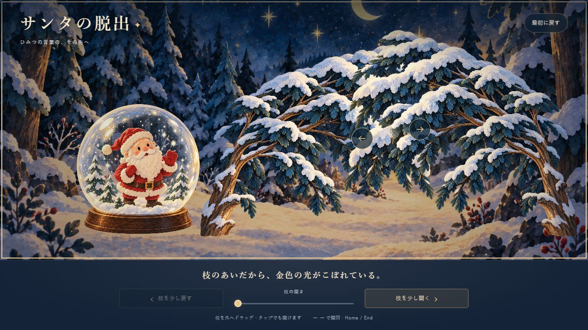 | 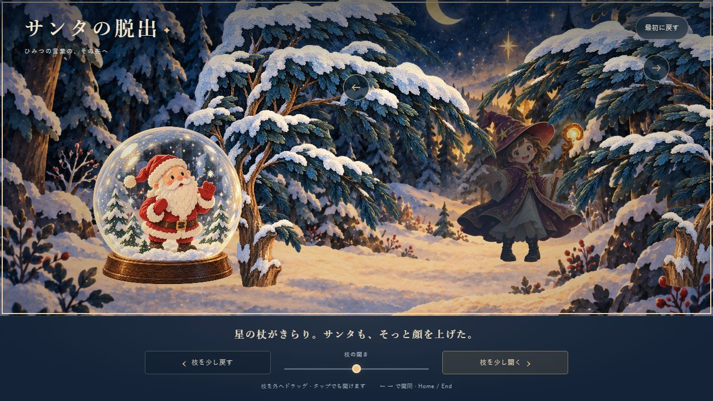 | 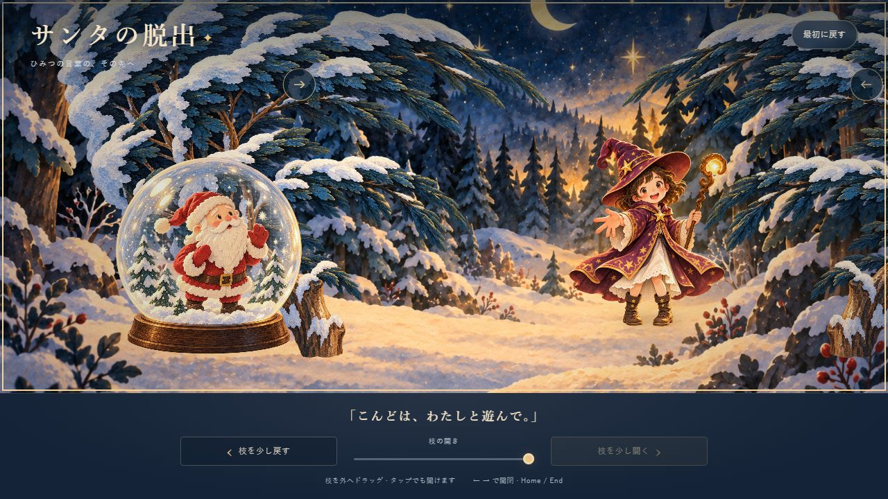 |

| 発見・390×844：開始 | 途中 | 完成 |
| --- | --- | --- |
| 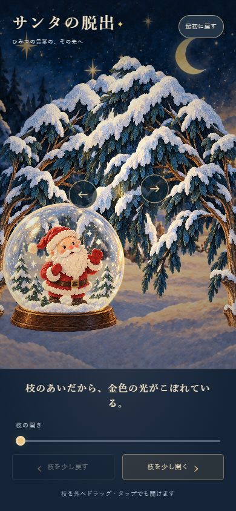 | 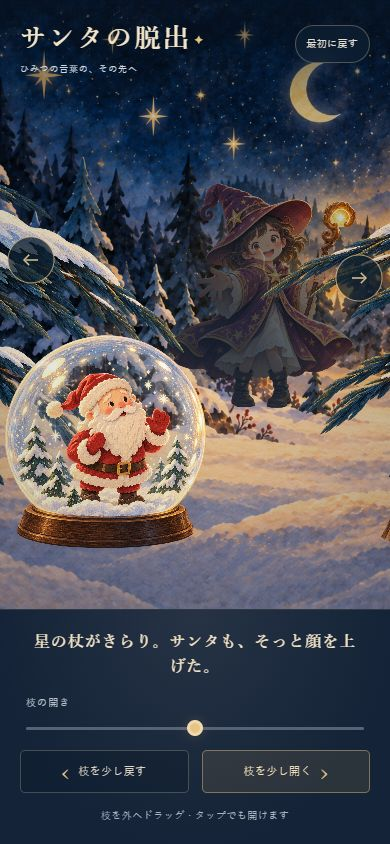 | 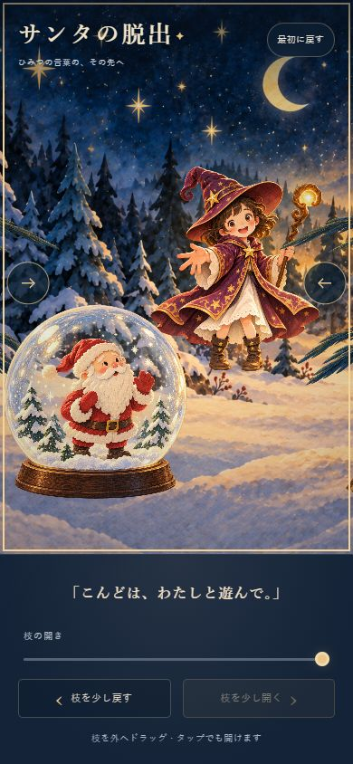 |

| 救出・通常幅：開始 | 途中 | 完成 |
| --- | --- | --- |
| 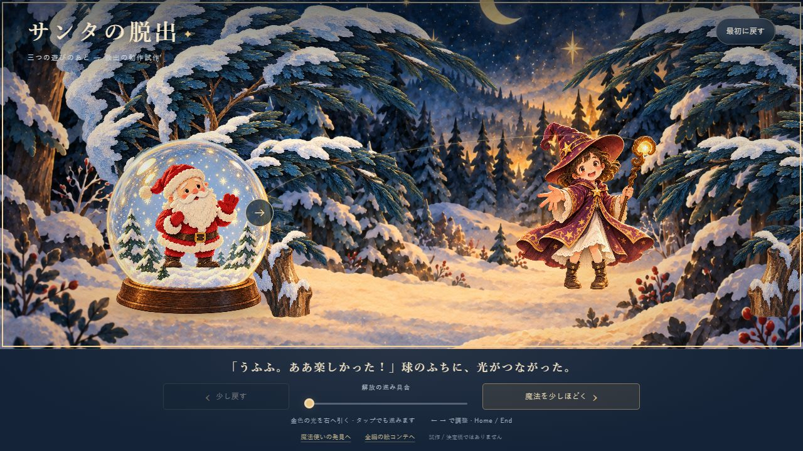 | 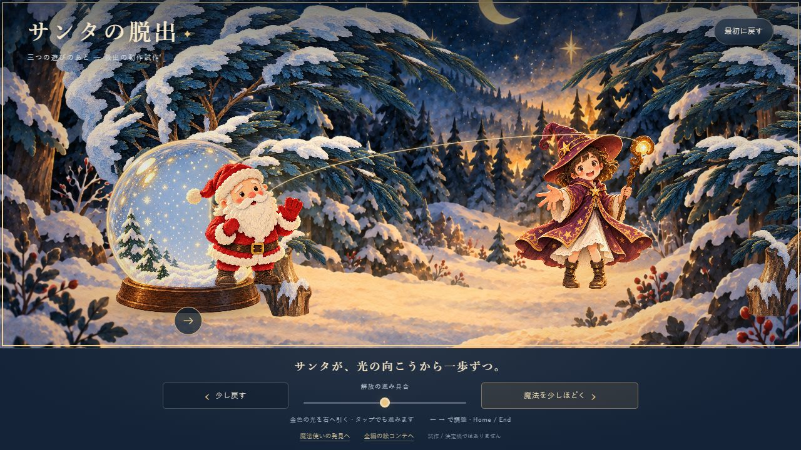 | 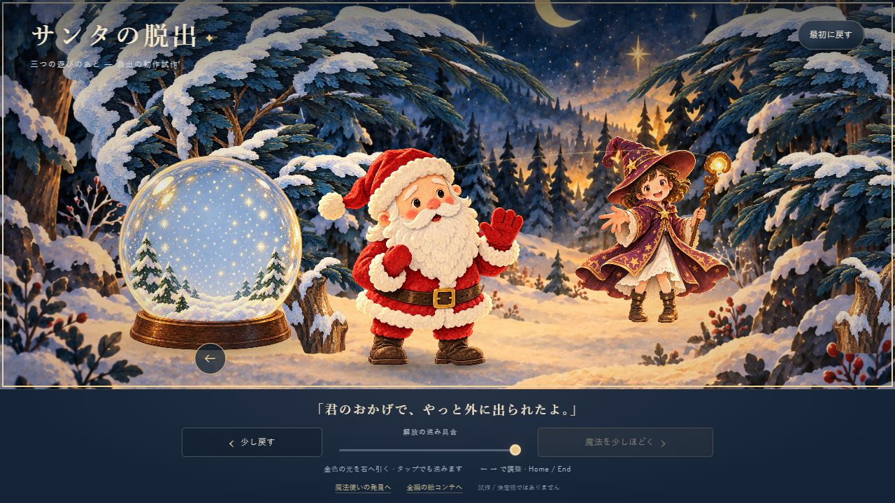 |

| 救出・390×844：開始 | 途中 | 完成 |
| --- | --- | --- |
| 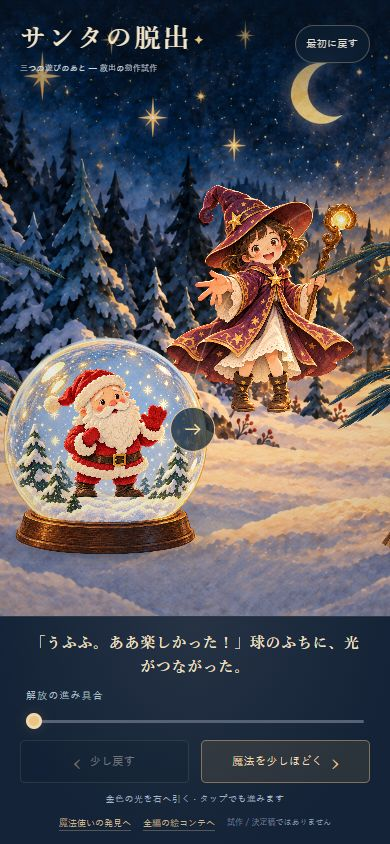 | 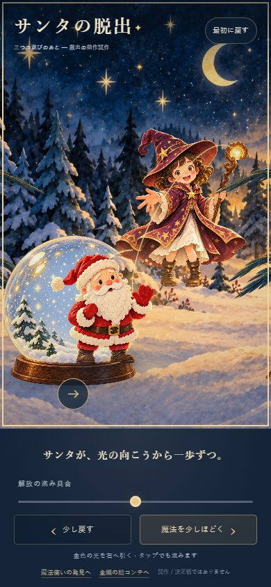 | 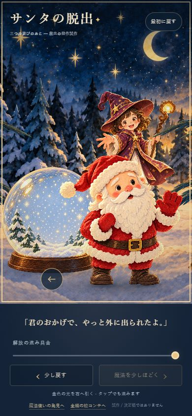 |

絵コンテ比較：[箱・通常幅](qa/refinement-2026-10-07/boxes-desktop.jpg) / [箱・390幅](qa/refinement-2026-10-07/boxes-mobile.jpg) / [会話・通常幅](qa/refinement-2026-10-07/question-desktop.jpg) / [会話・390幅](qa/refinement-2026-10-07/question-mobile.jpg) / [結末・通常幅](qa/refinement-2026-10-07/ending-desktop.jpg) / [結末・390幅](qa/refinement-2026-10-07/ending-mobile.jpg)。初回版の画像は上書きせず保存している。

## 魅力についての判断と残る課題

修正後も紙の質感、かわいい顔、深い青と金色の光は目視で保たれた。両足の左右が逆に見える印象は解消し、背景の縮尺が変わる印象の原因だった球の移動もなくなった。ここは制作側の視覚判断であり、初見の読者が「もっと奥を見たい」と感じることを実証した結果ではない。

全編は引き続き構図ラフで、自由探索・解答・保存・再会などのゲーム進行は未実装。箱もCSS図形のまま。次は赤い箱一つの調査と開封を、同じ構図を保って可逆に動かし、文字の読みやすさと発見の楽しさが両立するかを確認する。人物の接地影、救出の自然な歩行、球内サンタと球外素材の細部の一致は仕上げの課題として残る。

## 起動とプレビュー

`illustrated-prototype`で`npm start`。現在は4190番で配信中。別の空きポートには`npm start -- --port 4191`。

- [全編の絵コンテ](http://127.0.0.1:4190/storyboard/index.html)
- [枝を開く発見](http://127.0.0.1:4190/)
- [救出](http://127.0.0.1:4190/rescue/index.html)
