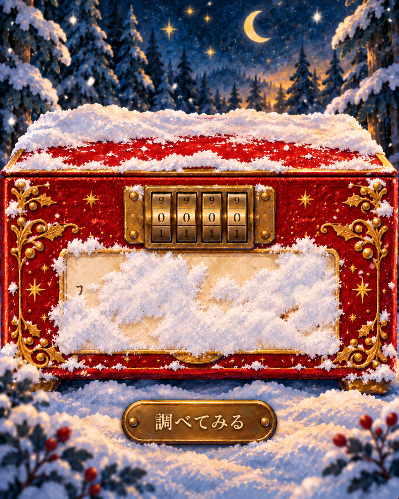

> 2026-10-08 同日追記：この画像作成の記録の後に、ユーザーの指示でブラウザ試作へ反映しました。さらに、雪を徐々に払って不規則に残す動きと、錠直下の試行ボタンへ修正しました。現在の状態は [操作説明](../../README.md) と [最新の雪・錠の確認記録](../../qa/BRUSHED-SNOW.md) を参照してください。以下の「未実装」は画像作成時点を指します。v3は引き続き構図参考です。

# 赤い箱：調べると雪が落ちる画像案

2026-10-08 JST。今回の依頼は「まずは画像」。組み込み image_gen.imagegen で生成し、初稿で見えすぎたたぬきの顔と最後の×を雪で隠す修正を行った。既存画像・実装は変更していない。

同日追記：錠がふたと本体の両方にまたがるv2の構造は、ユーザーの指摘を受けて撤回した。実物写真を確認し、錠全体を本体前面の上側に収めたv3が最新の画像案。[修正記録・実物資料・編集指示](LOCK-MOUNT-EDIT.md)。v2は経緯を確認するため残している。

## 今回確認するもの

- 四つの数字の円筒と取付プレートがすべて本体前面上部に収まり、ふたの継ぎ目をまたがず、実物の箱らしく見えるか。
- ヒント部分から黒い文字の断片・茶色い絵の端が少しのぞき、「何かある」が伝わるか。
- ふた・金縁・彫刻・足元にも積雪があり、ヒントだけを覆う白い面に見えないか。
- 深い青の森、赤い箱、暖かい金具、紙と絵の具の質感が既存の画風に合うか。

生成画像では四桁の中央は0000。本文の全語、たぬきの顔、ラベルの×は露出していないことを目視した。画像のみで「初見で調べたくなる」「錠だと気付く」を利用者検証したわけではない。

## 2026-10-08にユーザーが指定した方向

- タップは数字の選択ではなく、ダイアルを回す操作。上をタップしたら数字の列が上へ回転する。
- ヒントには順番がある。自由な場所をこすって三つを同時に読む案は採用しない。
- 「調べてみる」ボタンを押すと、アニメーションで雪が落ちて次のヒントが現れる。
- 最初から完全に覆い尽くすのでなく、隠れた記述の存在を示す断片を残す。
- ヒント以外の箇所にも自然に雪をかける。
- 錠全体は本体前面の上側に取り付ける。ふたと本体をまたぐ金具として描かない。ふたの継ぎ目と錠の上端の間に本体の余白を残す。
- 今回は画像作成まで。アニメーション・ダイアルの修正・ゲームへの反映は未実装。

## 次回の段階案

原作の記述と順を保持する。初期の四桁錠は見えており、手がかりを全て見る前でも数字を試せる方針は継続する。

| 状態 | 見える内容 |
| --- | --- |
| 調べる前 | 文字の断片、絵の茶色い端、紙の縁。意味はまだ読めない |
| 1回目 | 「サンタ、イタチ」「サンタ、ハタチ」の二行。絵・下のラベルはまだ隠れる |
| 2回目 | たぬきの絵が現れる。絵の下にも記述があると分かる |
| 3回目 | 絵の下の「たぬき」、最初の「た」の×が現れる |

この画像は調べる前だけを示す。三段階の雪の落ち方や時間、停止・連打時の挙動はまだ設計・検証していない。正確な謎の文字と操作する数字は、後の実装で独立して描画する。生成画像一枚を完成した動作素材として扱わない。

錠は本体前面上部に収め、ふたの継ぎ目より下に取り付けることが最新の指定。大きさや装飾は画像案として検討中。箱の外縁をアップ画面から切り取ることは許容する案だが、必要な操作や手がかり、戻る操作は収め、ページの横スクロールは生じさせない。

## 引き継ぎ

新しいセッションで実装する場合は、[HANDOFF.md](HANDOFF.md)を参照する。採用前の画像案であることと、実装依頼の範囲を最初に確認する。

生成指示は[PROMPTS.md](PROMPTS.md)。元の参照画像と生成原本は保持している。
