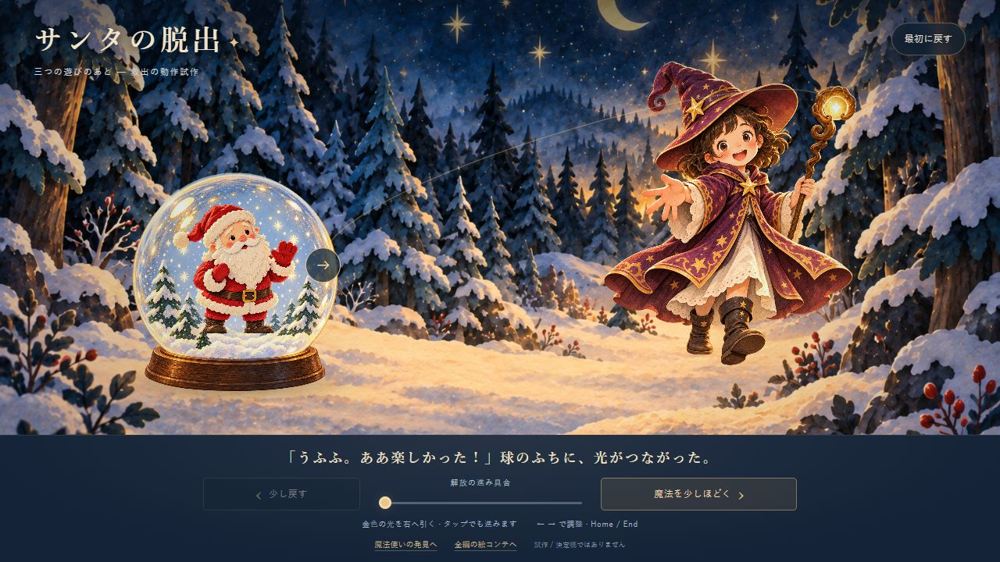
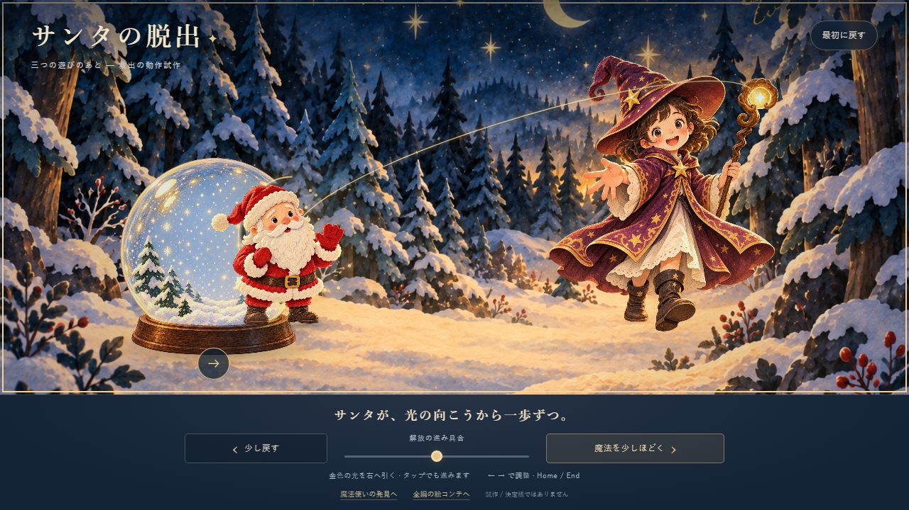
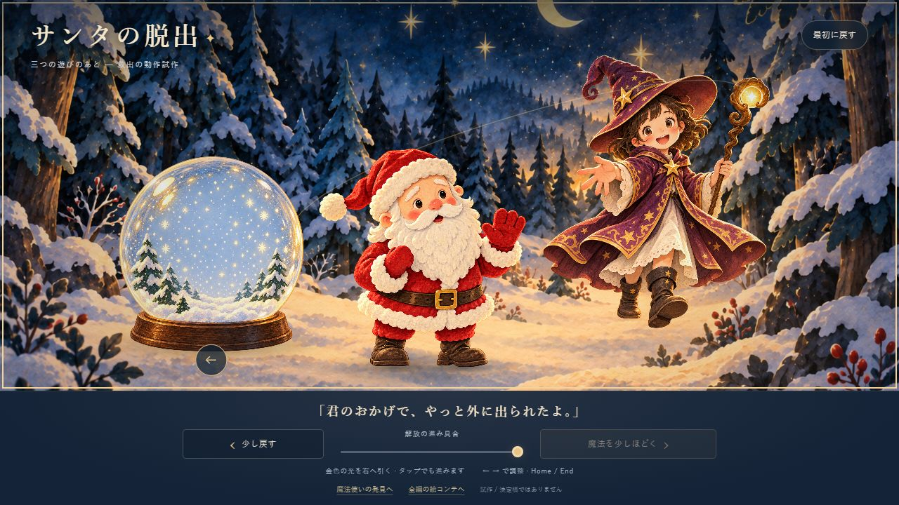
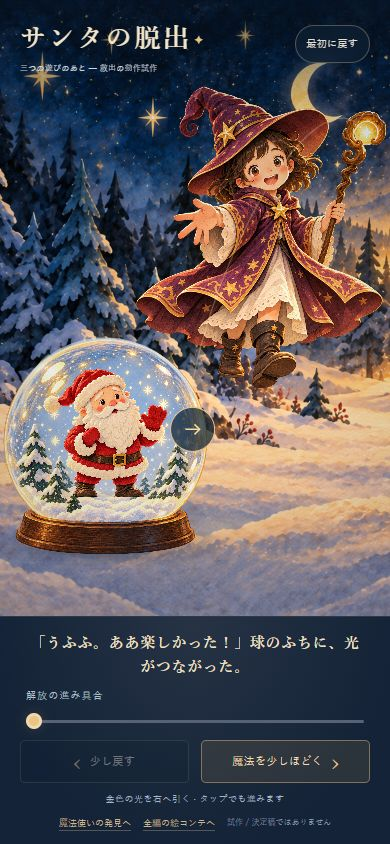
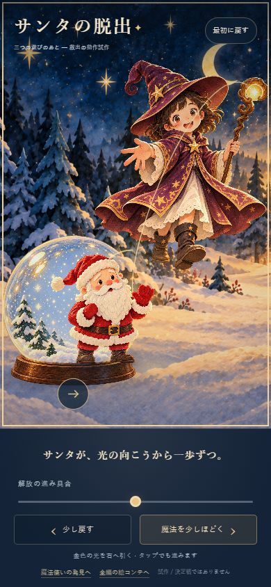
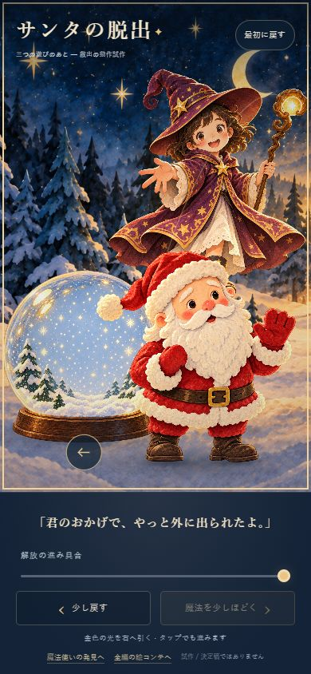

# 救出試作の確認記録

このページは救出試作の初回版の記録です。枝を残す構図・人物比率・脚の修正後の最新確認と画像は [追加修正の確認](../REFINEMENT.md) を参照してください。

2026-10-07。ローカルの実ブラウザ（Codex In-app Browser）で確認。URL: http://127.0.0.1:4190/rescue/index.html 。既存4190番の静的サーバーをそのまま利用し、4186番は操作していない。

## 実装の動作

| 項目 | 実際に確認したこと |
| --- | --- |
| 通常幅 | 1280×720、絵の領域1280×557。開始・途中・完了を目視し撮影。横はみ出しなし（scrollWidth=1280） |
| スマホ幅 | 390×844、絵の領域390×616。開始・途中・完了を目視し撮影。横はみ出しなし（scrollWidth=390）、body高さ844 |
| 途中停止 | 通常幅で右へ218pxドラッグ→p=0.50092。離して別の観察後も0.50092。390幅で92pxドラッグ→p=0.50191 |
| 逆戻し | 通常幅で左へ130px→p=0.20221。390幅で左へ55px→p=0.20185。最初に戻さず、その位置から戻る |
| タップ | 390幅の絵を5回タップし、各20%補間の終了を待って100%へ到達 |
| キー | Home、End、左右の矢印、Enterを実操作。開始、完了、±5%、20%進行を確認 |
| ボタンとスライダー | 開く/戻す、最初に戻すを実操作。ボタンの後にスライダーで35%へ調整し、再びボタンで55%へ。古い目標値へ跳ばない |
| 連続性 | 0→100%を5%刻みで操作し、25/40/60/80%も撮影。サンタの画像切替・突然の出現・消失は見られなかった。通常幅の絵の高さは全21状態で557px |
| 球の内外 | 開始では帽子・ミトン・靴が球内。途中で右側の開口から同じサンタが移り、完了では両足が外の雪に着き、球は空。スマホでは奥の球と手前のサンタが一部重なる構図 |
| エラー | 操作後の各救出タブでJavaScript error/warnログは0件。素材の読み込み完了を確認 |

ナレーションの改行により、スマホの絵の高さが変動する不具合を見つけ、文章の領域を二行分の固定高さへ修正した。修正後の開始・途中・完了は同じ390×616。操作矢印が中間のサンタの胴や完成時の靴に重なったため、人物が動く前に球の外周を通って台座下へ移す形に修正し、再撮影した。魔法の光もサンタの後ろに描き、顔の見え方を保った。両靴の下に小さな接地影を追加し、最終版を両サイズで再撮影した。

## 構文と数学の検査

親で `npm run check`、`npm test` を実行。JavaScript10ファイルの構文とローカル参照28件が成功。発見6群・救出6群が成功。依存インストールとコンパイルは不要。VM ModulesのExperimentalWarningは検査コマンドのNode警告で、ゲームのJSエラーではない。

救出は、実素材のトリム後比率と既定比率の計12レイアウト×1,001進捗で、有限値・範囲・単一サンタの不透明度・画面内の投影枠・可逆性を検査。開始の輪郭目印を球内、完成時の両足の目印を球外と確認。段階境界の位置・大きさ・足・光・前面反射が連続で、後半に開口が自然に閉じる。目印の検査は全塗りピクセルの保証ではない。

[ブラウザの数値記録](qa/browser-samples.json) / [数学検査](test.mjs)

## スクリーンショット

最終版。途中は実ドラッグで停止した約50%。

| 通常幅の開始 | 途中 | 完了 |
| --- | --- | --- |
|  |  |  |

| 390×844の開始 | 途中 | 完了 |
| --- | --- | --- |
|  |  |  |

追加: [25%](qa/transition-25.jpg) / [40%](qa/transition-40.jpg) / [60%](qa/transition-60.jpg) / [80%](qa/transition-80.jpg)

## 絵の魅力と、検証できていないこと

目視レビューでは、開始・途中・完了でかわいい表情、紙の粒子、青と金の色調を保てた。大きくなったサンタも同じ絵の世界に収まる。開始と完了の「球内→空の球＋外のサンタ」は読み取りやすい。この判断は制作側の美術評価であり、初見の読者の感情を実証したものではない。

中間は「球をすり抜けている」ようにも見えうる。出口の縁・前後の重なり・一歩の接地・腰と腕の演技を磨けば、解放の納得感が増す見込み。足の局所変形は歩行の粗い代用で、完成した歩行演技とは報告しない。発見の球内サンタと新しい全身素材の細部は完全一致ではなく、場面接続時の一貫性を確認する必要がある。

全編のゲーム進行、長い台詞のスマホ配置、初見の「もっと見たい」「助けられた」という感情、実機タッチ、他ブラウザは未検証。救出試作の操作成功と、全編の魅力が確認されたことは別である。
